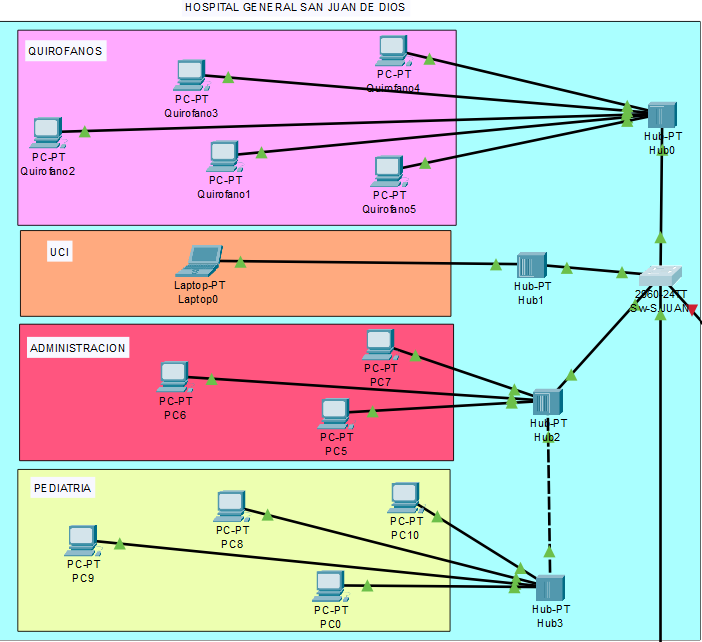
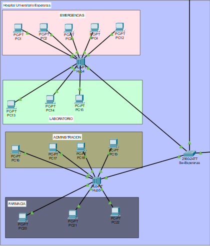
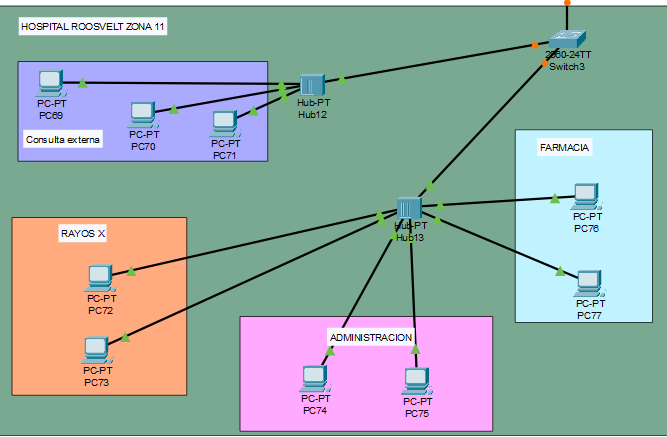
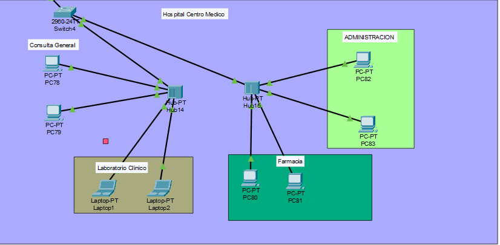
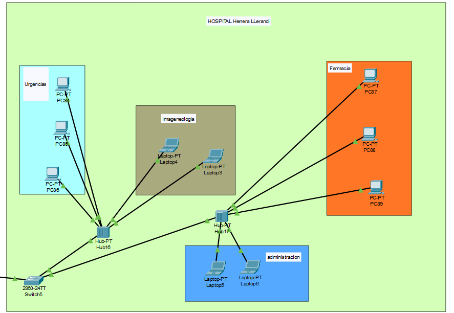
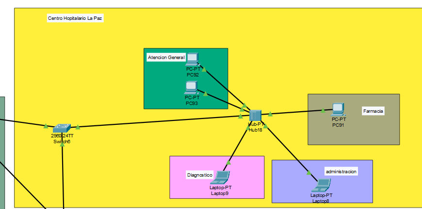
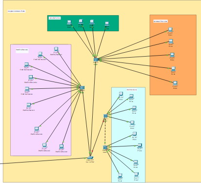

# Práctica 2 — Red de Hospitales Metropolitano
**Curso:** Redes de Computadoras 1

**Carnet:** 202101728

**Fecha:** Abril 2026

## Descripción
Red LAN segmentada con VLANs para 6 hospitales del área
metropolitana de Guatemala, implementada en Cisco Packet Tracer.

## Hospital 1 — Hospital General San Juan de Dios

El Hospital General San Juan de Dios es uno de los hospitales públicos más
importantes de Guatemala, ubicado en la zona 1 de la Ciudad de Guatemala.
En esta práctica se modela su infraestructura de red con un total de **25 hosts**
distribuidos en 4 áreas funcionales.

### Dispositivos en la topología
Para efectos de demostración, se representaron 13 dispositivos en la topología
de Packet Tracer. Los 12 hosts restantes se consideran en el cálculo de
subnetting pero no se colocan físicamente en el simulador, tal como lo
permite el enunciado de la práctica.

| Área | Dispositivos visibles | Hosts totales considerados |
|------|-----------------------|---------------------------|
| Quirófanos (VLAN 18) | 5 PCs | 10 |
| UCI (VLAN 28) | 1 Laptop | 5 |
| Administración (VLAN 38) | 3 PCs | 5 |
| Pediatría (VLAN 48) | 4 PCs | 5 |
| **Total** | **13** | **25** |

### Topología utilizada: Estrella

Se utilizó una topología de **estrella** donde un Switch central (Switch0,
modelo Cisco 2960-24TT) interconecta los diferentes segmentos de cada área
del hospital. Cada área tiene su propio Hub que agrupa los hosts locales.

**Justificación:**
- Permite aislar fallas: si un Hub falla, solo afecta su área.
- El Switch central facilita la segmentación por VLANs.
- Facilita la administración y el monitoreo del tráfico.
- Escalable: se pueden agregar más áreas sin rediseñar la topología.

### Dominios de Colisión

El enunciado requiere exactamente **3 dominios de colisión** para este hospital.
Para lograrlo se utilizaron 4 Hubs con la siguiente estrategia:

| Dominio | Dispositivos | Áreas cubiertas |
|---------|-------------|-----------------|
| Dominio 1 | Hub0 | Quirófanos |
| Dominio 2 | Hub1 | UCI |
| Dominio 3 | Hub2 + Hub3 | Administración y Pediatría |

### Configuracion 
enable
conf t

hostname SW-SJJUAN
no ip domain-lookup

enable secret 202101728

line console 0
password 202101728
login
exit
vlan 18
name QUIROFANOS

vlans
vlan 28
name UCI

vlan 38
name ADMIN

vlan 48
name PEDIATRIA

vlan 99
name NATIVA

vlan 999
name BLACKHOLE

VTPS
vtp mode server
vtp domain 202101728
vtp password area1

SSTP
spanning-tree mode rapid-pvst
spanning-tree vlan 18,28,38,48 root primary

**Justificación técnica:**
- **Hub0** conecta los 5 equipos de Quirófanos directamente al Switch0,
  formando el **Dominio 1**.
- **Hub1** conecta la Laptop de UCI directamente al Switch0,
  formando el **Dominio 2**.
- **Hub3** (Pediatría) se conectó a **Hub2** (Administración) mediante un
  cable **crossover**, fusionando ambas áreas en un único dominio de colisión.
  Hub2 luego conecta al Switch0, formando el **Dominio 3**.

> La decisión de unir Administración y Pediatría en un mismo dominio fue
> intencional para cumplir exactamente con los 3 dominios requeridos.
> El cable crossover entre Hub2 y Hub3 es técnicamente correcto ya que
> se trata de una conexión Hub-Hub (dispositivos del mismo tipo).

“Se utilizó un esquema de direccionamiento continuo dentro de la red 192.168.8.0/24, segmentado por VLANs para permitir comunicación estructurada entre hospitales.”

## Hospital 2 — Hospital Universitario Esperanza

El Hospital Universitario Esperanza es un centro de salud ficticio utilizado
en esta práctica para representar la interconexión entre hospitales dentro
de una red metropolitana. Se modela su infraestructura de red considerando
un total de **25 hosts**, distribuidos en 4 áreas funcionales.

### Dispositivos en la topología
Para efectos de demostración, se representaron 15 dispositivos en la topología
de Packet Tracer. Los demás hosts se consideran en el cálculo de subnetting,
pero no se colocan físicamente en el simulador, tal como lo permite el enunciado.

| Área | Dispositivos visibles | Hosts totales considerados |
|------|-----------------------|---------------------------|
| Emergencias (VLAN 18) | 5 PCs | 10 |
| Laboratorio (VLAN 28) | 3 PCs | 5 |
| Administración (VLAN 38) | 4 PCs | 5 |
| Farmacia (VLAN 48) | 3 PCs | 5 |
| **Total** | **15** | **25** |

---

### Topología utilizada: Estrella

Se utilizó una topología de **estrella** donde un Switch central
(SW-ESPERANZA, modelo Cisco 2960-24TT) interconecta los diferentes
segmentos de cada área del hospital.

Cada área está conectada mediante Hubs que agrupan los hosts.

**Justificación:**
- Permite una administración centralizada mediante el switch.
- Facilita la implementación de VLANs.
- Aísla fallos por segmento.
- Escalable para futuras ampliaciones.

---

### Dominios de Colisión

El enunciado requiere exactamente **2 dominios de colisión** para este hospital.

Se implementaron de la siguiente manera:

| Dominio | Dispositivos | Áreas cubiertas |
|---------|-------------|-----------------|
| Dominio 1 | Hub0 | Emergencias |
| Dominio 2 | Hub1 + Hub2 + Hub3 | Laboratorio, Administración, Farmacia |

**Justificación técnica:**
- **Hub0** conecta directamente los dispositivos de Emergencias,
  formando el primer dominio de colisión.
- **Hub1, Hub2 y Hub3** están interconectados mediante cables crossover,
  formando un único dominio compartido.
- Esto permite cumplir exactamente con los **2 dominios requeridos**.

---

### Direccionamiento IP

Se utilizó un esquema de direccionamiento continuo basado en la red:
192.168.8.0/24

#### VLAN 18 — Emergencias

| Dispositivo | IP | Máscara | Gateway |
|------------|----|--------|--------|
| PC1 | 192.168.8.7 | 255.255.255.128 | 192.168.8.1 |
| PC2 | 192.168.8.8 | 255.255.255.128 | 192.168.8.1 |
| PC3 | 192.168.8.9 | 255.255.255.128 | 192.168.8.1 |
| PC4 | 192.168.8.10 | 255.255.255.128 | 192.168.8.1 |
| PC12 | 192.168.8.11 | 255.255.255.128 | 192.168.8.1 |

---

#### VLAN 28 — Laboratorio

| Dispositivo | IP | Máscara | Gateway |
|------------|----|--------|--------|
| PC13 | 192.168.8.131 | 255.255.255.192 | 192.168.8.129 |
| PC14 | 192.168.8.132 | 255.255.255.192 | 192.168.8.129 |
| PC15 | 192.168.8.133 | 255.255.255.192 | 192.168.8.129 |

---

#### VLAN 38 — Administración

| Dispositivo | IP | Máscara | Gateway |
|------------|----|--------|--------|
| PC16 | 192.168.8.197 | 255.255.255.224 | 192.168.8.193 |
| PC17 | 192.168.8.198 | 255.255.255.224 | 192.168.8.193 |
| PC18 | 192.168.8.199 | 255.255.255.224 | 192.168.8.193 |
| PC19 | 192.168.8.200 | 255.255.255.224 | 192.168.8.193 |

---

#### VLAN 48 — Farmacia

| Dispositivo | IP | Máscara | Gateway |
|------------|----|--------|--------|
| PC20 | 192.168.8.230 | 255.255.255.240 | 192.168.8.225 |
| PC21 | 192.168.8.231 | 255.255.255.240 | 192.168.8.225 |
| PC22 | 192.168.8.232 | 255.255.255.240 | 192.168.8.225 |

---

### Configuración del Switch (SW-ESPERANZA)
enable
conf t

hostname SW-ESPERANZA
no ip domain-lookup

enable secret 202101728

line console 0
password 202101728
login
exit

vtp mode client
vtp domain 202101728
vtp password area1

spanning-tree mode rapid-pvst

---

### Configuración de Puertos

**Puertos de acceso:**
interface range fa0/1 - 5
switchport mode access
switchport access vlan 18

interface range fa0/6 - 8
switchport mode access
switchport access vlan 28

interface range fa0/9 - 12
switchport mode access
switchport access vlan 38

interface range fa0/13 - 15
switchport mode access
switchport access vlan 48

---

**Puertos no utilizados (seguridad):**
interface range fa0/16 - 20
switchport mode access
switchport access vlan 999
shutdown

---

### EtherChannel y Troncales

Se configuró EtherChannel con **PAgP** entre switches principales:

interface range fa0/21 - 23
switchport mode trunk
switchport trunk native vlan 99
channel-group 1 mode desirable

interface port-channel 1
switchport mode trunk
switchport trunk native vlan 99

---

### Justificación General

- Se utilizó VTP en modo cliente para centralizar la gestión de VLANs.
- Se implementó Rapid PVST+ para evitar bucles en la red.
- Se aplicó EtherChannel para mejorar el rendimiento y redundancia.
- Se utilizó VLAN 99 como nativa y VLAN 999 como medida de seguridad.
- El direccionamiento IP es continuo y eficiente.

---

## Hospital 3 — Roosvelt Zona 11

El Centro Médico Metropolitano es un hospital ficticio utilizado para representar
otro nodo dentro de la red metropolitana de salud. Se modela con un total de
**32 hosts**, distribuidos en distintas áreas funcionales.

### Dispositivos en la topología

Para efectos de simulación, se representaron únicamente 10 dispositivos en Packet Tracer.
El resto de hosts se consideran en el cálculo de subnetting.

| Área | Dispositivos visibles | Hosts totales considerados |
|------|-----------------------|---------------------------|
| Consulta Externa (VLAN 18) | 3 PCs | 10 |
| Rayos X (VLAN 28) | 2 PCs | 8 |
| Administración (VLAN 38) | 3 PCs | 8 |
| Farmacia (VLAN 48) | 2 PCs | 6 |
| **Total** | **10** | **32** |

---

### Topología utilizada: Estrella

Se utilizó una topología de estrella con un switch central (SW-H3)
que conecta todos los segmentos del hospital.

**Justificación:**
- Permite una administración centralizada.
- Facilita la segmentación mediante VLANs.
- Reduce impacto de fallas.
- Es escalable.

---

### Dominios de Colisión

El hospital requiere exactamente **2 dominios de colisión**.

| Dominio | Dispositivos | Áreas |
|--------|-------------|------|
| Dominio 1 | Hub0 | Consulta Externa + Rayos X |
| Dominio 2 | Hub1 + Hub2 | Administración + Farmacia |

**Justificación técnica:**
- Se conectaron dos áreas en cada dominio usando hubs.
- Se utilizó conexión crossover entre hubs para fusionar dominios.
- Se cumple exactamente el requisito del enunciado.

---

### Direccionamiento IP

Se utilizó la red base:
192.168.8.0/24

#### VLAN 18 — Consulta Externa

| Dispositivo | IP | Máscara | Gateway |
|------------|----|--------|--------|
| PC1 | 192.168.8.12 | 255.255.255.128 | 192.168.8.1 |
| PC2 | 192.168.8.13 | 255.255.255.128 | 192.168.8.1 |
| PC3 | 192.168.8.14 | 255.255.255.128 | 192.168.8.1 |

---

#### VLAN 28 — Rayos X

| Dispositivo | IP | Máscara | Gateway |
|------------|----|--------|--------|
| PC4 | 192.168.8.134 | 255.255.255.192 | 192.168.8.129 |
| PC5 | 192.168.8.135 | 255.255.255.192 | 192.168.8.129 |

---

#### VLAN 38 — Administración

| Dispositivo | IP | Máscara | Gateway |
|------------|----|--------|--------|
| PC6 | 192.168.8.201 | 255.255.255.224 | 192.168.8.193 |
| PC7 | 192.168.8.202 | 255.255.255.224 | 192.168.8.193 |
| PC8 | 192.168.8.203 | 255.255.255.224 | 192.168.8.193 |

---

#### VLAN 48 — Farmacia

| Dispositivo | IP | Máscara | Gateway |
|------------|----|--------|--------|
| PC9 | 192.168.8.233 | 255.255.255.240 | 192.168.8.225 |
| PC10 | 192.168.8.234 | 255.255.255.240 | 192.168.8.225 |

---

### Configuración del Switch
enable
conf t

hostname SW-H3
no ip domain-lookup

vtp mode client
vtp domain 202101728
vtp password area1

spanning-tree mode rapid-pvst

---

### EtherChannel y Troncales
interface range fa0/21 - 23
switchport mode trunk
switchport trunk native vlan 99
channel-group 1 mode desirable

interface port-channel 1
switchport mode trunk
switchport trunk native vlan 99

---
### Direccionamiento IP — Hospital 3 (Centro Médico Metropolitano)

Se continúa con el esquema de direccionamiento de la red:
192.168.8.0/24

---

#### VLAN 18 — Consulta Externa

| Dispositivo | Dirección IP | Máscara | Gateway |
|------------|-------------|--------|--------|
| PC1 | 192.168.8.12 | 255.255.255.128 | 192.168.8.1 |
| PC2 | 192.168.8.13 | 255.255.255.128 | 192.168.8.1 |
| PC3 | 192.168.8.14 | 255.255.255.128 | 192.168.8.1 |

---

#### VLAN 28 — Rayos X

| Dispositivo | Dirección IP | Máscara | Gateway |
|------------|-------------|--------|--------|
| PC4 | 192.168.8.134 | 255.255.255.192 | 192.168.8.129 |
| PC5 | 192.168.8.135 | 255.255.255.192 | 192.168.8.129 |

---

#### VLAN 38 — Administración

| Dispositivo | Dirección IP | Máscara | Gateway |
|------------|-------------|--------|--------|
| PC6 | 192.168.8.201 | 255.255.255.224 | 192.168.8.193 |
| PC7 | 192.168.8.202 | 255.255.255.224 | 192.168.8.193 |
| PC8 | 192.168.8.203 | 255.255.255.224 | 192.168.8.193 |

---

#### VLAN 48 — Farmacia

| Dispositivo | Dirección IP | Máscara | Gateway |
|------------|-------------|--------|--------|
| PC9 | 192.168.8.233 | 255.255.255.240 | 192.168.8.225 |
| PC10 | 192.168.8.234 | 255.255.255.240 | 192.168.8.225 |

---

### Nota

Las direcciones IP continúan de manera secuencial desde los hospitales anteriores,
manteniendo un esquema de direccionamiento continuo dentro de cada VLAN para evitar
duplicidad y optimizar el uso del espacio de direcciones.

### Justificación General

- Se utilizó VTP para centralizar la administración de VLANs.
- Rapid PVST+ evita bucles en la red.
- EtherChannel mejora rendimiento y redundancia.
- VLAN 99 se usa como nativa y VLAN 999 para seguridad.

---

## Hospital 4 — Centro Médico

El Centro Médico es un hospital diseñado para representar un nodo adicional
en la red metropolitana. Se consideran **15 hosts** distribuidos en distintas áreas.

### Dispositivos en la topología

| Área | Dispositivos visibles | Hosts totales |
|------|----------------------|--------------|
| Consulta General (VLAN 18) | 2 PCs | 5 |
| Laboratorio Clínico (VLAN 28) | 2 Laptops | 4 |
| Administración (VLAN 38) | 2 PCs | 3 |
| Farmacia (VLAN 48) | 2 PCs | 3 |
| **Total** | **8** | **15** |

---

### Topología utilizada: Estrella

Se utilizó una topología estrella con un switch central.

**Justificación:**
- Administración sencilla
- Segmentación por VLAN
- Escalabilidad

---

### Dominios de Colisión

Se implementaron **2 dominios**:

| Dominio | Dispositivos | Áreas |
|--------|-------------|------|
| Dominio 1 | Hub0 | Consulta + Laboratorio |
| Dominio 2 | Hub1 + Hub2 | Administración + Farmacia |

---

### Direccionamiento IP
192.168.8.0/24

#### VLAN 18 — Consulta General

| Dispositivo | IP | Máscara | Gateway |
|------------|----|--------|--------|
| PC1 | 192.168.8.15 | 255.255.255.128 | 192.168.8.1 |
| PC2 | 192.168.8.16 | 255.255.255.128 | 192.168.8.1 |

---

#### VLAN 28 — Laboratorio

| Dispositivo | IP | Máscara | Gateway |
|------------|----|--------|--------|
| Laptop1 | 192.168.8.136 | 255.255.255.192 | 192.168.8.129 |
| Laptop2 | 192.168.8.137 | 255.255.255.192 | 192.168.8.129 |

#### VLAN 18 — Consulta General

| Dispositivo | IP | Máscara | Gateway |
|------------|----|--------|--------|
| PC1 | 192.168.8.15 | 255.255.255.128 | 192.168.8.1 |
| PC2 | 192.168.8.16 | 255.255.255.128 | 192.168.8.1 |

---

#### VLAN 28 — Laboratorio

| Dispositivo | IP | Máscara | Gateway |
|------------|----|--------|--------|
| Laptop1 | 192.168.8.136 | 255.255.255.192 | 192.168.8.129 |
| Laptop2 | 192.168.8.137 | 255.255.255.192 | 192.168.8.129 |

---

#### VLAN 38 — Administración

| Dispositivo | IP | Máscara | Gateway |
|------------|----|--------|--------|
| PC3 | 192.168.8.204 | 255.255.255.224 | 192.168.8.193 |
| PC4 | 192.168.8.205 | 255.255.255.224 | 192.168.8.193 |

---

#### VLAN 48 — Farmacia

| Dispositivo | IP | Máscara | Gateway |
|------------|----|--------|--------|
| PC5 | 192.168.8.235 | 255.255.255.240 | 192.168.8.225 |
| PC6 | 192.168.8.236 | 255.255.255.240 | 192.168.8.225 |

---

### Configuración del Switch
hostname SW-CENTRO
vtp mode client
vtp domain 202101728
vtp password area1
spanning-tree mode rapid-pvst

---

### Justificación

Se utilizó direccionamiento continuo, VLANs para segmentación,
VTP para administración centralizada y EtherChannel para redundancia.

## Hospital 5 — Clínica Integral Metropolitana

La Clínica Integral Metropolitana representa un hospital adicional dentro
de la red metropolitana. Se consideran **26 hosts** distribuidos en varias áreas.

### Dispositivos en la topología

| Área | Dispositivos visibles | Hosts totales |
|------|----------------------|--------------|
| Urgencias (VLAN 18) | 3 PCs | 10 |
| Imagenología (VLAN 28) | 2 Laptops | 6 |
| Administración (VLAN 38) | 3 PCs | 5 |
| Farmacia (VLAN 48) | 2 PCs | 5 |
| **Total** | **10** | **26** |

---

### Topología utilizada: Estrella

Se utilizó una topología de estrella con un switch central.

---

### Dominios de Colisión

Se implementaron **2 dominios**:

| Dominio | Dispositivos | Áreas |
|--------|-------------|------|
| Dominio 1 | Hub0 | Urgencias + Imagenología |
| Dominio 2 | Hub1 + Hub2 | Administración + Farmacia |

---

### Direccionamiento IP
192.168.8.0/24

#### VLAN 18 — Urgencias

| Dispositivo | IP | Máscara | Gateway |
|------------|----|--------|--------|
| PC1 | 192.168.8.17 | 255.255.255.128 | 192.168.8.1 |
| PC2 | 192.168.8.18 | 255.255.255.128 | 192.168.8.1 |
| PC3 | 192.168.8.19 | 255.255.255.128 | 192.168.8.1 |

---

#### VLAN 28 — Imagenología

| Dispositivo | IP | Máscara | Gateway |
|------------|----|--------|--------|
| Laptop1 | 192.168.8.138 | 255.255.255.192 | 192.168.8.129 |
| Laptop2 | 192.168.8.139 | 255.255.255.192 | 192.168.8.129 |

---

#### VLAN 38 — Administración

| Dispositivo | IP | Máscara | Gateway |
|------------|----|--------|--------|
| PC4 | 192.168.8.206 | 255.255.255.224 | 192.168.8.193 |
| PC5 | 192.168.8.207 | 255.255.255.224 | 192.168.8.193 |
| PC6 | 192.168.8.208 | 255.255.255.224 | 192.168.8.193 |

---

#### VLAN 48 — Farmacia

| Dispositivo | IP | Máscara | Gateway |
|------------|----|--------|--------|
| PC7 | 192.168.8.237 | 255.255.255.240 | 192.168.8.225 |
| PC8 | 192.168.8.238 | 255.255.255.240 | 192.168.8.225 |

---

### Configuración del Switch
hostname SW-H5
vtp mode client
vtp domain 202101728
vtp password area1
spanning-tree mode rapid-pvst

---

### Justificación

Se utilizó direccionamiento continuo, VLANs para segmentación,
VTP para administración centralizada y EtherChannel para redundancia.

## Hospital 6 — Clínica Básica Metropolitana

La Clínica Básica Metropolitana representa el hospital más pequeño de la red.
Se consideran **8 hosts** distribuidos en distintas áreas.

### Dispositivos en la topología

| Área | Dispositivos visibles | Hosts totales |
|------|----------------------|--------------|
| Atención General (VLAN 18) | 2 PCs | 3 |
| Diagnóstico (VLAN 28) | 1 Laptop | 2 |
| Administración (VLAN 38) | 1 PC | 2 |
| Farmacia (VLAN 48) | 1 PC | 1 |
| **Total** | **5** | **8** |

---

### Topología utilizada: Estrella

Se utilizó una topología simple con un switch central.

---

### Dominios de Colisión

Se implementó **1 dominio de colisión**:

| Dominio | Dispositivos | Áreas |
|--------|-------------|------|
| Dominio 1 | Hub0 | Todas las áreas |

---

### Direccionamiento IP
192.168.8.0/24

#### VLAN 18 — Atención General

| Dispositivo | IP | Máscara | Gateway |
|------------|----|--------|--------|
| PC1 | 192.168.8.20 | 255.255.255.128 | 192.168.8.1 |
| PC2 | 192.168.8.21 | 255.255.255.128 | 192.168.8.1 |

---

#### VLAN 28 — Diagnóstico

| Dispositivo | IP | Máscara | Gateway |
|------------|----|--------|--------|
| Laptop1 | 192.168.8.140 | 255.255.255.192 | 192.168.8.129 |

---

#### VLAN 38 — Administración

| Dispositivo | IP | Máscara | Gateway |
|------------|----|--------|--------|
| PC3 | 192.168.8.209 | 255.255.255.224 | 192.168.8.193 |

---

#### VLAN 48 — Farmacia

| Dispositivo | IP | Máscara | Gateway |
|------------|----|--------|--------|
| PC4 | 192.168.8.239 | 255.255.255.240 | 192.168.8.225 |

---

### Configuración del Switch
hostname SW-H6
vtp mode client
vtp domain 202101728
vtp password area1
spanning-tree mode rapid-pvst

---

### Justificación

Se utilizó un único dominio de colisión para cumplir el requisito del enunciado.
El direccionamiento IP es continuo y eficiente.

## Hospital 7 — Hospital Regional Avanzado

El Hospital Regional Avanzado representa un centro de atención médica con mayor
capacidad dentro de la red metropolitana. Se consideran **32 hosts** distribuidos
en diferentes áreas funcionales.

---

### Dispositivos en la topología

| Área | Dispositivos visibles | Hosts totales |
|------|----------------------|--------------|
| Emergencias (VLAN 18) | 3 PCs | 10 |
| Radiología (VLAN 28) | 2 Laptops | 8 |
| Administración (VLAN 38) | 3 PCs | 8 |
| Farmacia (VLAN 48) | 2 PCs | 6 |
| **Total** | **10** | **32** |

---

### Topología utilizada: Estrella

Se utilizó una topología de estrella con un switch central (SW-H7) que conecta
todas las áreas mediante hubs.

**Justificación:**
- Permite administración centralizada
- Facilita segmentación por VLAN
- Reduce impacto de fallas
- Es escalable

---

### Dominios de Colisión

Se implementaron **2 dominios de colisión**:

| Dominio | Dispositivos | Áreas |
|--------|-------------|------|
| Dominio 1 | Hub0 | Emergencias + Radiología |
| Dominio 2 | Hub1 + Hub2 | Administración + Farmacia |

**Justificación técnica:**
- Se agruparon áreas en hubs para cumplir el número exacto de dominios
- Se utilizó cable crossover entre hubs para unificar dominios

---

### Direccionamiento IP

Se utilizó el esquema de red:

#### VLAN 18 — Emergencias

| Dispositivo | IP | Máscara | Gateway |
|------------|----|--------|--------|
| PC1 | 192.168.8.22 | 255.255.255.128 | 192.168.8.1 |
| PC2 | 192.168.8.23 | 255.255.255.128 | 192.168.8.1 |
| PC3 | 192.168.8.24 | 255.255.255.128 | 192.168.8.1 |

---

#### VLAN 28 — Radiología

| Dispositivo | IP | Máscara | Gateway |
|------------|----|--------|--------|
| Laptop1 | 192.168.8.141 | 255.255.255.192 | 192.168.8.129 |
| Laptop2 | 192.168.8.142 | 255.255.255.192 | 192.168.8.129 |

---

#### VLAN 38 — Administración

| Dispositivo | IP | Máscara | Gateway |
|------------|----|--------|--------|
| PC4 | 192.168.8.210 | 255.255.255.224 | 192.168.8.193 |
| PC5 | 192.168.8.211 | 255.255.255.224 | 192.168.8.193 |
| PC6 | 192.168.8.212 | 255.255.255.224 | 192.168.8.193 |

---

#### VLAN 48 — Farmacia

| Dispositivo | IP | Máscara | Gateway |
|------------|----|--------|--------|
| PC7 | 192.168.8.240 | 255.255.255.240 | 192.168.8.225 |
| PC8 | 192.168.8.241 | 255.255.255.240 | 192.168.8.225 |

---

### Configuración del Switch
enable
conf t

hostname SW-H7
no ip domain-lookup

enable secret 202101728

line console 0
password 202101728
login
exit

vtp mode client
vtp domain 202101728
vtp password area1

spanning-tree mode rapid-pvst

enable
conf t

hostname SW-H7
no ip domain-lookup

enable secret 202101728

line console 0
password 202101728
login
exit

vtp mode client
vtp domain 202101728
vtp password area1

spanning-tree mode rapid-pvst

---

### Puertos no utilizados
interface range fa0/11 - 20
switchport mode access
switchport access vlan 999
shutdown

---

### EtherChannel y Troncales

interface range fa0/21 - 23
switchport mode trunk
switchport trunk native vlan 99
channel-group 1 mode desirable

interface port-channel 1
switchport mode trunk
switchport trunk native vlan 99

---

### Justificación General

- Se utilizó direccionamiento continuo
- VLANs para segmentación lógica
- VTP para administración centralizada
- STP para evitar bucles
- EtherChannel para redundancia y rendimiento
