# Manual Técnico - Tarea 3
## Redes de Computadoras 1
Universidad de San Carlos de Guatemala  
Facultad de Ingeniería  
Ingeniería en Ciencias y Sistemas  

**Estudiante:** Iris Carolina Guzmán  
**Carnet:** 202101728  
**Fecha:** 27 de febrero de 2026

## 1. Introducción

En la presente práctica se implementó una red en Cisco Packet Tracer 
con cuatro switches Cisco 2960 y seis PCs.

Se configuraron VLANs, VTP en distintos modos (Server, Client, Transparent),
asignación de puertos y pruebas de conectividad.

## 2. Objetivo SMART

**Específico:** Configurar una red en Packet Tracer implementando VLANs y VTP.

**Medible:** Verificar propagación correcta mediante `show vtp status`
y conectividad con ping.

**Alcanzable:** Utilizando comandos vistos en clase.

**Realista:** Aplicar segmentación de red en entorno empresarial.

**A Tiempo:** Entrega dentro del período establecido.

## 3. Topología de la Red

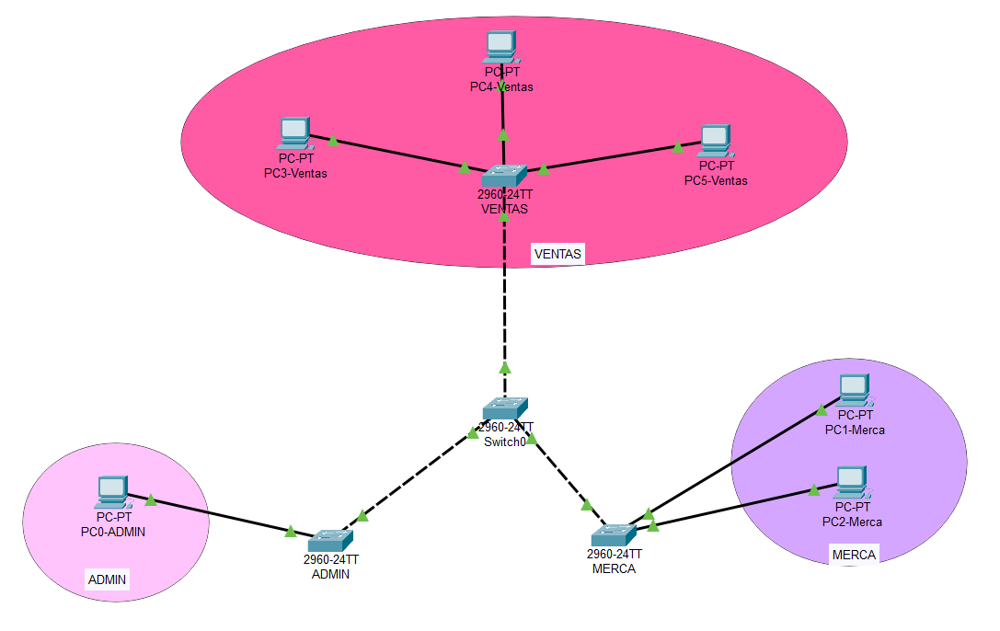

La red está compuesta por:

- 4 Switches Cisco 2960
- 6 PCs
- 3 VLANs: ADMIN, MERCA y VENTAS

## 4. Configuración IP de los Equipos Finales

Las direcciones IP fueron configuradas manualmente (modo estático)
en cada equipo, asignando una red distinta por VLAN para garantizar
la segmentación lógica de la red.

Cada VLAN pertenece a una subred diferente /24.

### PC0 - ADMIN

- Interfaz: FastEthernet0
- Tipo de configuración: Estática
- Dirección IP: 192.168.10.10
- Máscara de Subred: 255.255.255.0
- Gateway Predeterminado: 0.0.0.0
- DNS: 0.0.0.0
- VLAN asignada: VLAN 10 (ADMIN)

### PC2 - MERCA

- Interfaz: FastEthernet0
- Tipo de configuración: Estática
- Dirección IP: 192.168.20.10
- Máscara de Subred: 255.255.255.0
- Gateway Predeterminado: 0.0.0.0
- DNS: 0.0.0.0
- VLAN asignada: VLAN 20 (MERCA)

### PC3 - MERCA

- Interfaz: FastEthernet0
- Tipo de configuración: Estática
- Dirección IP: 192.168.20.11
- Máscara de Subred: 255.255.255.0
- Gateway Predeterminado: 0.0.0.0
- DNS: 0.0.0.0
- VLAN asignada: VLAN 20 (MERCA)

  Ambas PCs pertenecen a la misma subred, por lo tanto pueden comunicarse entre sí sin necesidad de un router.

### PC4 - VENTAS

- Interfaz: FastEthernet0
- Tipo de configuración: Estática
- Dirección IP: 192.168.30.10
- Máscara de Subred: 255.255.255.0
- Gateway Predeterminado: 0.0.0.0
- DNS: 0.0.0.0
- VLAN asignada: VLAN 30 (VENTAS)

### PC5 - VENTAS

- Interfaz: FastEthernet0
- Tipo de configuración: Estática
- Dirección IP: 192.168.30.11
- Máscara de Subred: 255.255.255.0
- Gateway Predeterminado: 0.0.0.0
- DNS: 0.0.0.0
- VLAN asignada: VLAN 30 (VENTAS)

### PC6 - VENTAS

- Interfaz: FastEthernet0
- Tipo de configuración: Estática
- Dirección IP: 192.168.30.12
- Máscara de Subred: 255.255.255.0
- Gateway Predeterminado: 0.0.0.0
- DNS: 0.0.0.0
- VLAN asignada: VLAN 30 (VENTAS)
  
  Las tres PCs pertenecen a la red 192.168.30.0/24, por lo tanto pueden comunicarse entre sí. No existe conectividad con otras VLANs debido a la ausencia de enrutamiento inter-VLAN.

## Tabla Resumen de Direccionamiento

| PC   | VLAN   | Dirección IP      | Máscara        | Gateway |
|------|--------|------------------|---------------|---------|
| PC0  | ADMIN  | 192.168.10.10    | 255.255.255.0 | 0.0.0.0 |
| PC2  | MERCA  | 192.168.20.10    | 255.255.255.0 | 0.0.0.0 |
| PC3  | MERCA  | 192.168.20.11    | 255.255.255.0 | 0.0.0.0 |
| PC4  | VENTAS | 192.168.30.10    | 255.255.255.0 | 0.0.0.0 |
| PC5  | VENTAS | 192.168.30.11    | 255.255.255.0 | 0.0.0.0 |
| PC6  | VENTAS | 192.168.30.12    | 255.255.255.0 | 0.0.0.0 |

## Análisis de Segmentación

Cada VLAN fue configurada con una subred diferente (/24),
lo que garantiza aislamiento de broadcast y segmentación
lógica de la red.

Sin un dispositivo de capa 3 (router o switch capa 3),
no existe comunicación entre VLANs.

## 5. Configuración Inicial de los Switches

Como parte de la configuración básica, se asignó un hostname
a cada switch para facilitar la identificación dentro de la red
y mejorar la administración del entorno.

El procedimiento fue el siguiente:

### Switch ADMIN
enable
configure terminal
hostname ADMIN
exit

Resultado en consola:
El prompt cambió de:

Switch(config)#

a:

ADMIN(config)#

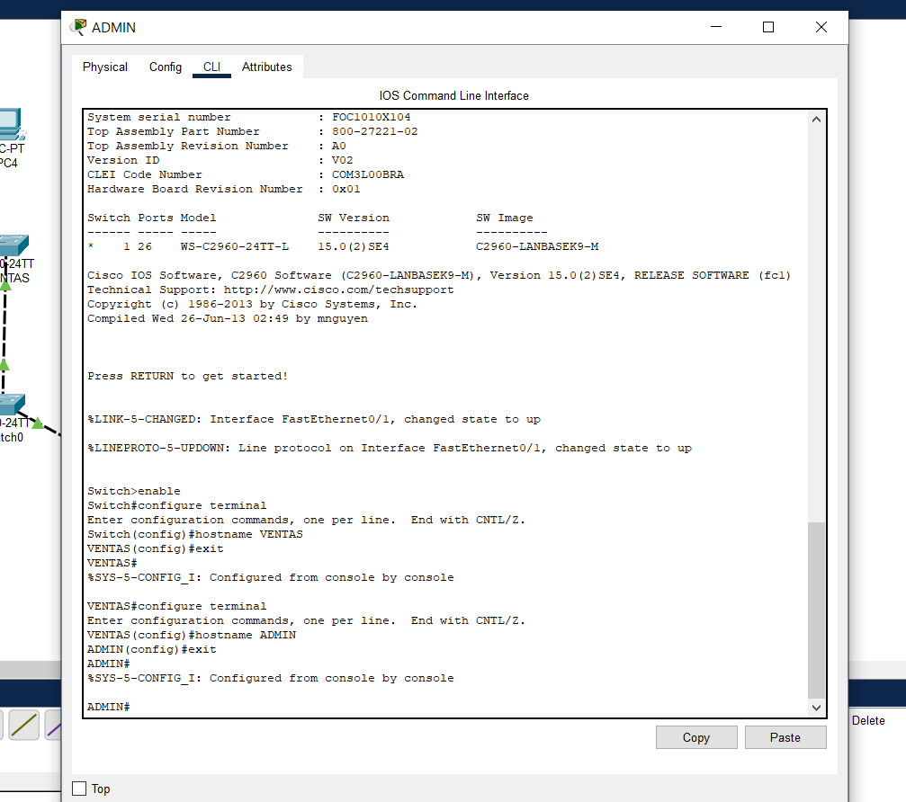

### Switch VENTAS
enable
configure terminal
hostname VENTAS
exit

Resultado en consola:
El prompt cambió de:

Switch(config)#

a:

VENTAS(config)#

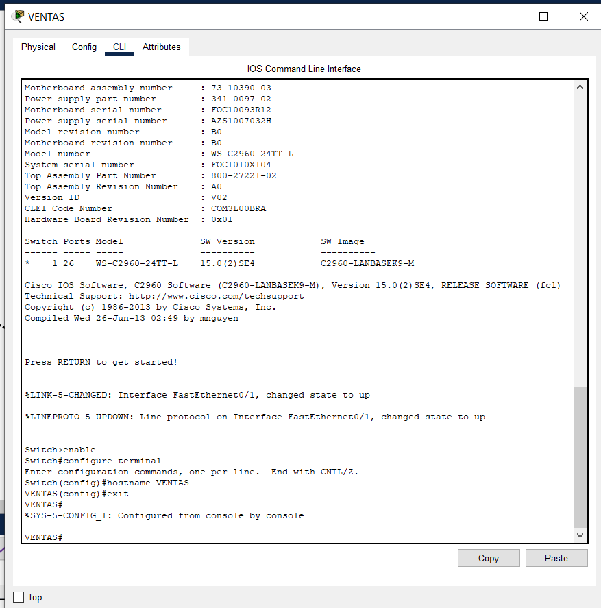

### Switch MERCA
enable
configure terminal
hostname MERCA
exit

Resultado en consola:
El prompt cambió de:

Switch(config)#

a:

MERCA(config)#

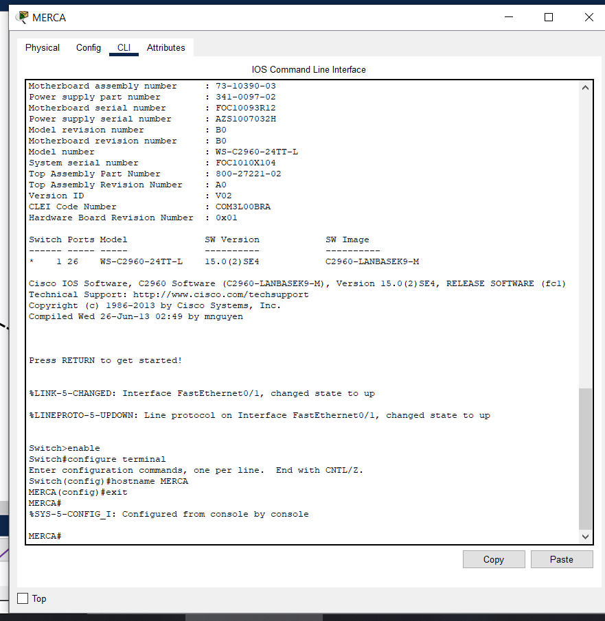

## 6. Configuración de Enlaces Trunk

El Switch0 fue configurado como dispositivo central de la red,
estableciendo enlaces trunk hacia los demás switches
para permitir el transporte de múltiples VLANs.

### Switch0 – Configuración de Trunk
enable
configure terminal

interface fa0/1
switchport mode trunk

interface fa0/2
switchport mode trunk

interface fa0/3
switchport mode trunk

exit

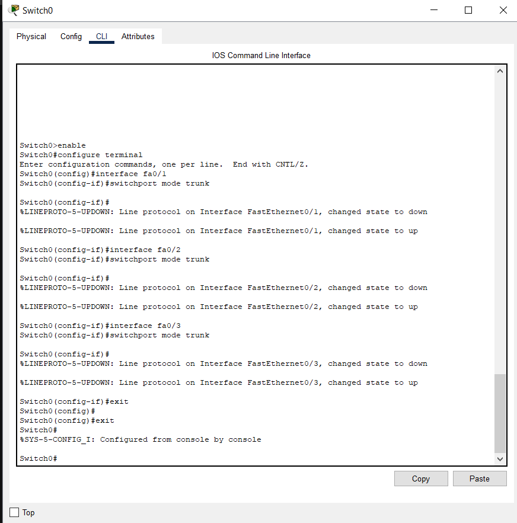

Los puertos configurados en modo trunk permiten el transporte
de tráfico etiquetado (802.1Q) correspondiente a múltiples VLANs
entre switches.

Sin esta configuración, las VLANs no podrían propagarse
correctamente entre dispositivos.

## 7. Configuración del Protocolo VTP

Se configuró el dominio VTP con el nombre **Redes1**,
estableciendo diferentes modos de operación según el rol
de cada switch en la topología.

### Switch0 – Modo Server
enable
configure terminal
vtp version 2
vtp domain Redes1
vtp mode server
exit

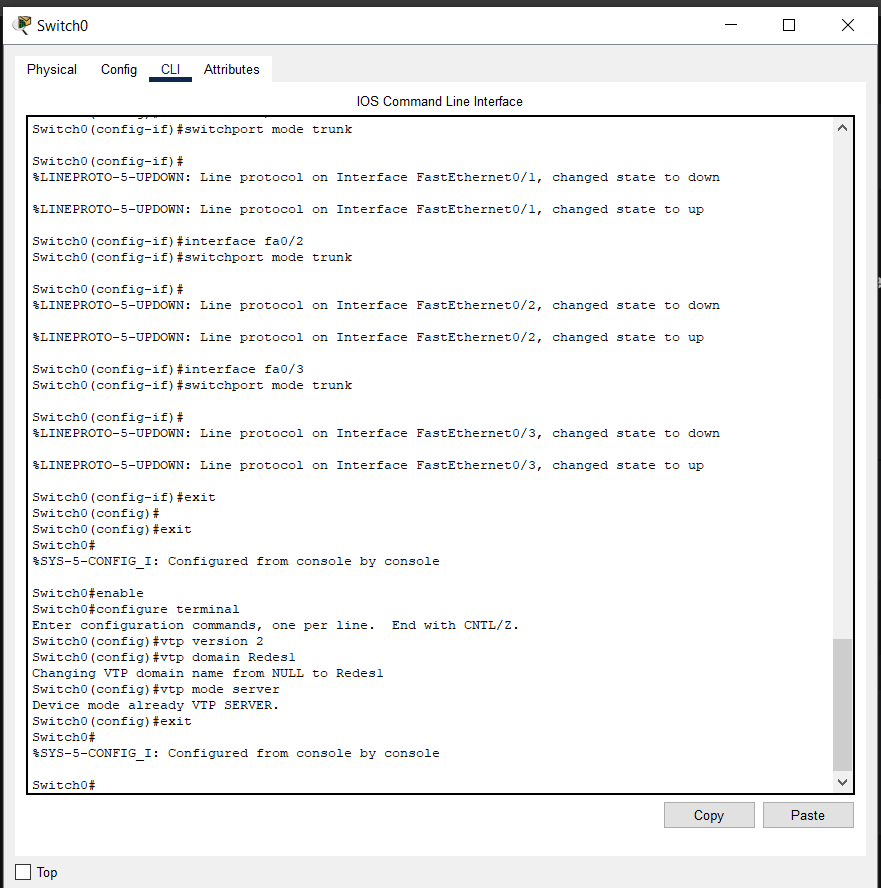

### Switch ADMIN – Modo Client

enable
configure terminal
vtp domain Redes1
vtp mode client
exit

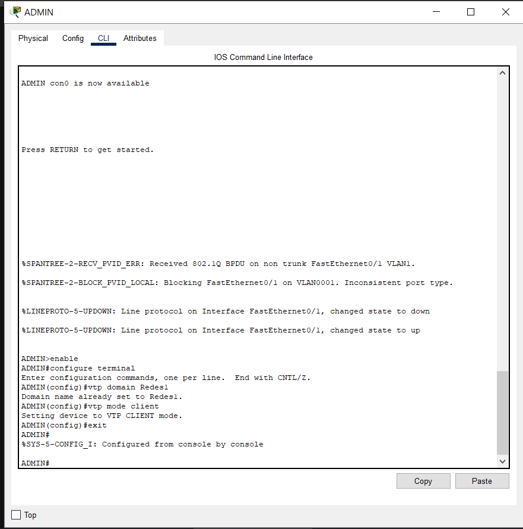

### Switch MERCA – Modo Client
enable
configure terminal
vtp domain Redes1
vtp mode client
exit

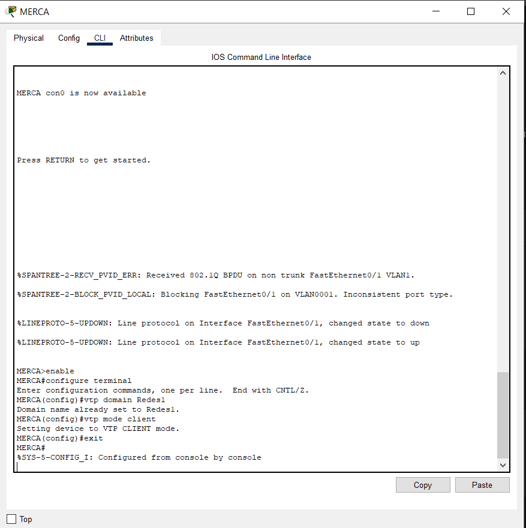

### Switch VENTAS – Modo Transparent
enable
configure terminal
vtp domain Redes1
vtp mode transparent
exit

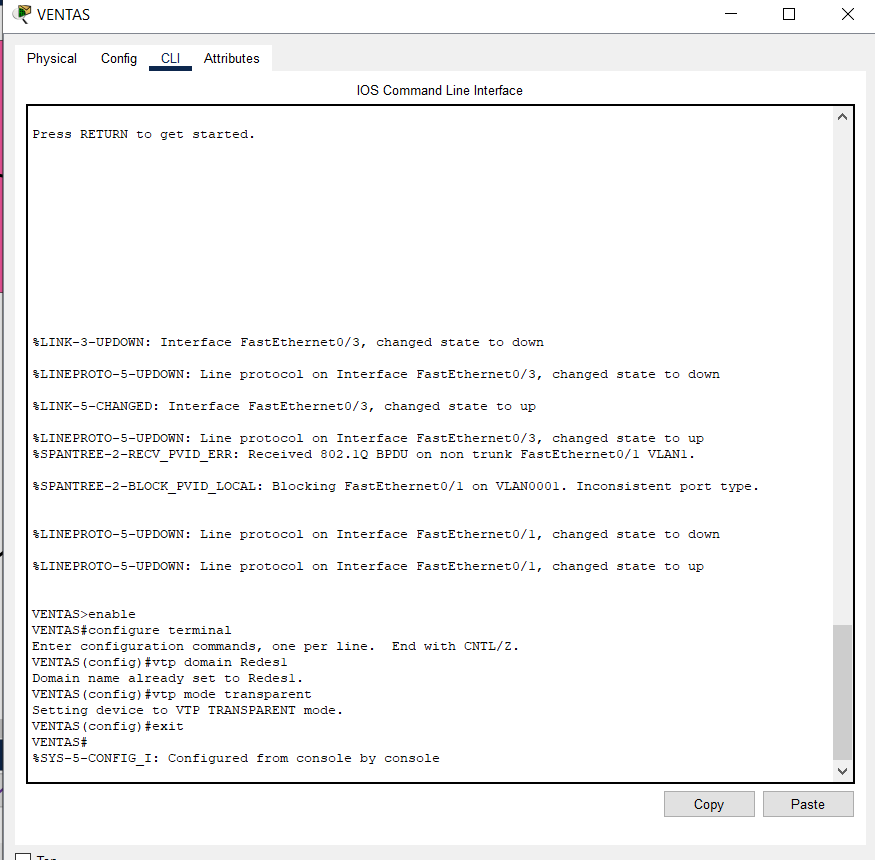

### Funcionamiento del VTP

- El Switch0 actúa como servidor VTP, siendo el responsable
  de crear y propagar las VLANs.
- Los switches ADMIN y MERCA operan como clientes,
  recibiendo automáticamente la información de VLANs.
- El switch VENTAS opera en modo transparente,
  reenviando anuncios VTP pero manteniendo su base de datos local.

Esto permitió la propagación automática de las VLANs a través de la red.

## 8. Configuración de Puertos de Acceso

Se configuraron los puertos conectados a las PCs en modo access,
asignándolos a la VLAN correspondiente según el departamento.

Los enlaces entre switches permanecen en modo trunk.

### Switch ADMIN – VLAN 10
enable
configure terminal
interface fa0/1
switchport mode access
switchport access vlan 10
exit

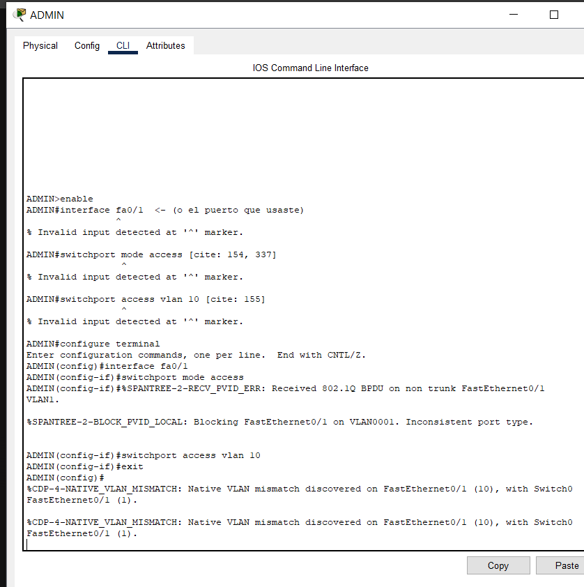

El puerto fue configurado en modo access, lo que permite que solo transporte tráfico de una única VLAN (VLAN 10 – ADMIN).
Este puerto conecta directamente a la PC0.

### Switch MERCA – VLAN 20
enable
configure terminal
interface range fa0/1 - 2
switchport mode access
switchport access vlan 20
exit

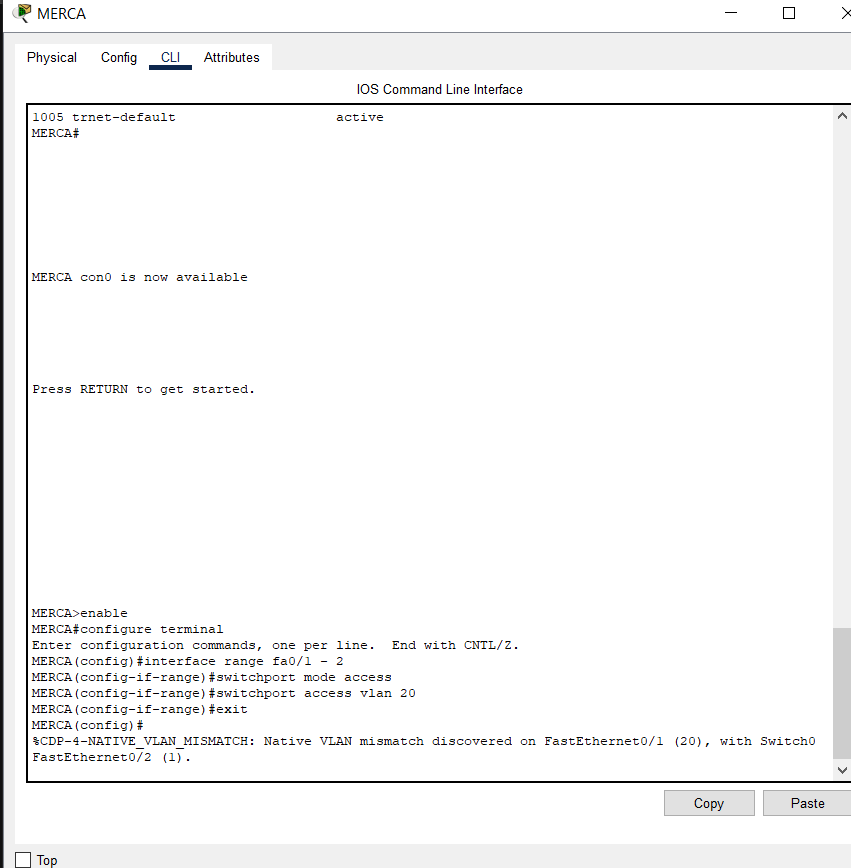

Se utilizó interface range para configurar múltiples puertos
de manera simultánea, asignándolos a la VLAN 20 (MERCA).

Esto permite que las PCs de MERCA compartan la misma red lógica.

### Switch VENTAS – VLAN 30
enable
configure terminal
interface range fa0/1 - 3
switchport mode access
switchport access vlan 30
exit

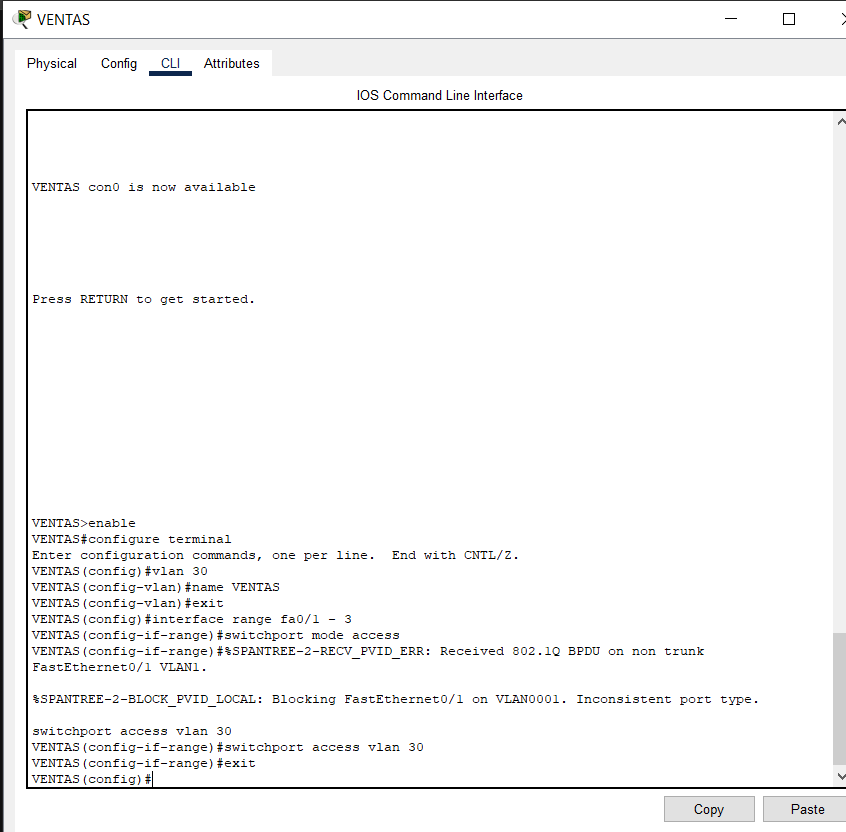

Los puertos fueron configurados como access
y asignados a la VLAN 30 (VENTAS),
permitiendo comunicación únicamente dentro
de la subred 192.168.30.0/24.

## 9. Verificación de VLANs

Para comprobar la correcta creación y propagación de las VLANs
mediante VTP, se ejecutó el comando:

show vlan brief en cada switch.

### Switch ADMIN

show vlan brief

Análisis:

Se observa la presencia de las VLAN 10 (ADMIN),
20 (MERCA) y 30 (VENTAS) en estado active,
confirmando la correcta propagación desde el servidor VTP.

### Switch MERCA
show vlan brief

Análisis:

Las VLANs fueron recibidas correctamente
desde el Switch0 (modo server),
validando el funcionamiento del protocolo VTP.

### Switch VENTAS
show vlan brief

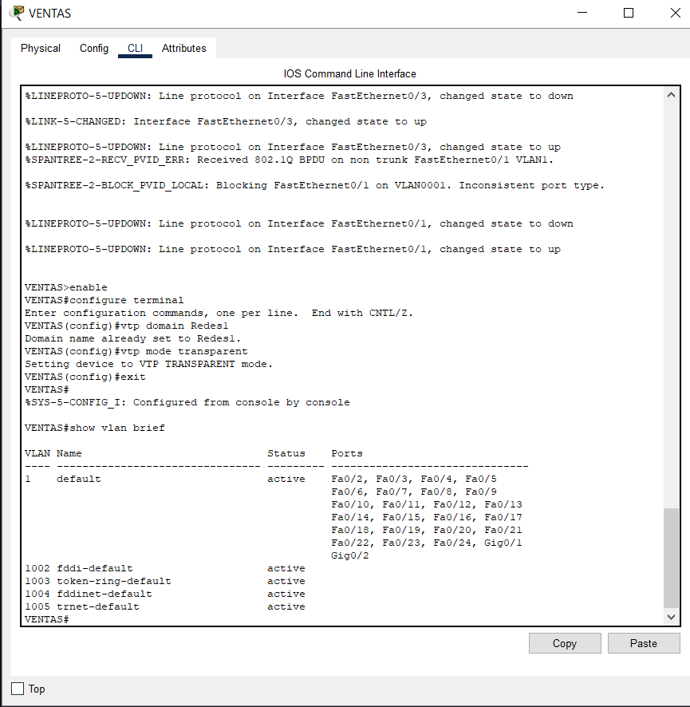

Análisis:

Aunque el switch se encuentra en modo VTP Transparent,
mantiene la base de datos VLAN local y reenvía
los anuncios VTP sin modificarlos.

## 10. Pruebas de Conectividad

Se realizaron pruebas de conectividad para validar:

- Comunicación exitosa dentro de la misma VLAN.
- Aislamiento entre VLANs distintas.

### PC0 (ADMIN) → PC4 (VENTAS)

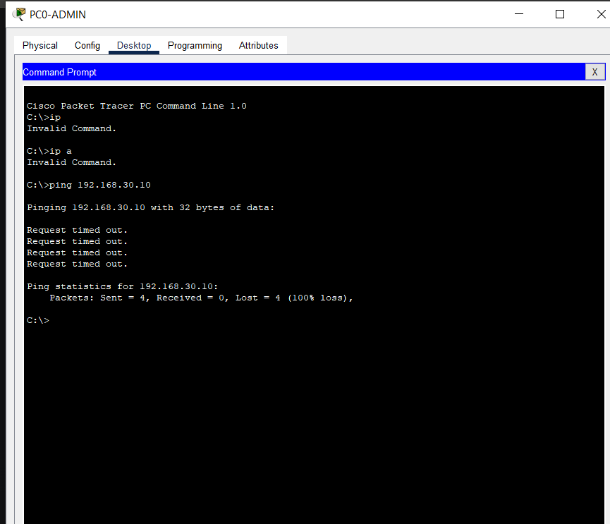

### PC2 → PC3 (Misma VLAN 20)
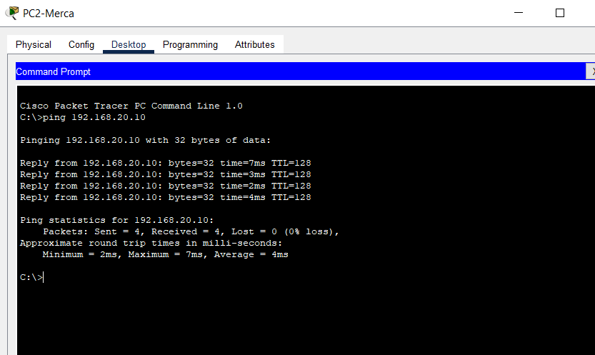

Conclusión:

La comunicación dentro de la misma VLAN es exitosa.

### PC3 → PC0 (VLAN 20 → VLAN 10)

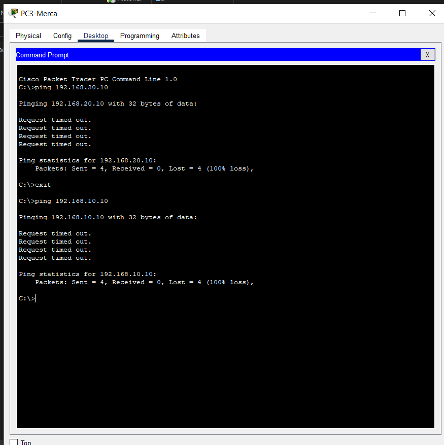

### PC6 → PC4
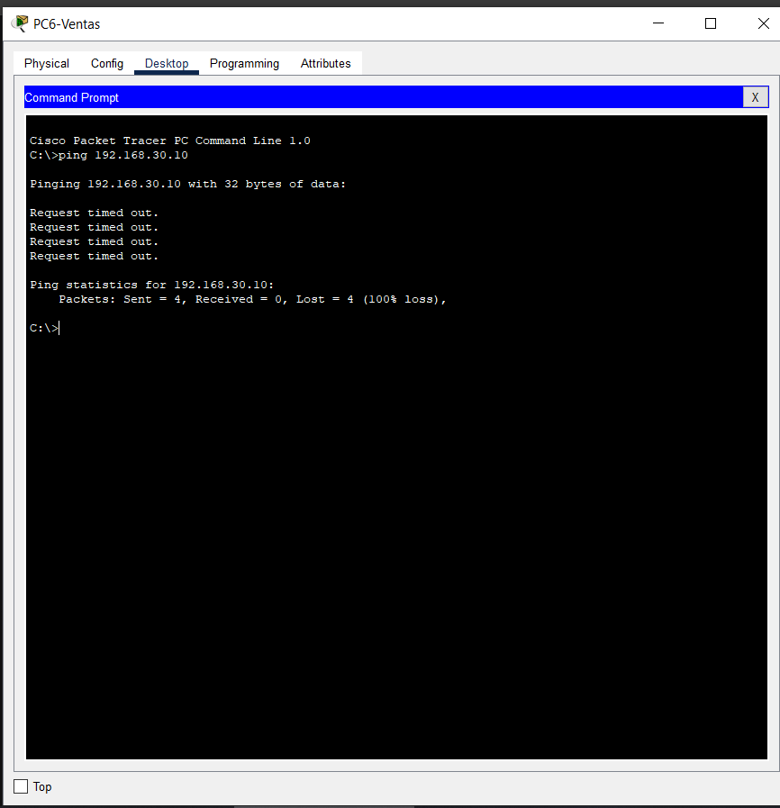

## 11. Observaciones Técnicas

Durante la configuración se observaron mensajes del tipo:

- SPANTREE-2-RECV_PVID_ERR
- CDP-4-NATIVE_VLAN_MISMATCH

Estos mensajes aparecen cuando:

- Un extremo del enlace está configurado como trunk
- El otro extremo está configurado como access
- Existe diferencia en la VLAN nativa

Estos avisos no afectaron la segmentación final,
pero evidencian la importancia de mantener coherencia
entre configuraciones de puertos en enlaces entre switches.

La red cumple correctamente con los objetivos:

- Segmentación mediante VLANs.
- Propagación automática usando VTP.
- Aislamiento entre redes distintas.
