#  Manual Técnico — Proyecto 2: BanTech GT
### Infraestructura Financiera y Alta Disponibilidad

**Universidad San Carlos de Guatemala**  
**Facultad de Ingeniería — Ingeniería en Ciencias y Sistemas**  
**Redes de Computadoras 1**
**Manual Técnico — Proyecto 2 BanTech GT**
**Carnet: 202101728**


| Campo | Detalle |
|---|---|
| **Carnet** | 202101728 |
| **XX** | 28 |
| **Y** | 8 |
| **Dominio VTP** | bantech28 |
| **Password VTP** | cisco |

---

##  Índice

1. [Descripción General](#1-descripción-general)
2. [Topología General](#2-topología-general)
3. [Backbone Core](#3-backbone-core)
4. [Sede Occidente](#4-sede-occidente)
5. [Sede Norte](#5-sede-norte)
6. [Sede Oriente](#6-sede-oriente)
7. [Data Center](#7-data-center)
8. [Pruebas de Conectividad Global](#8-pruebas-de-conectividad-global)

---

## 1. Descripción General

Este proyecto implementa la infraestructura de red corporativa de la entidad financiera **BanTech GT**, diseñada para garantizar alta disponibilidad, tolerancia a fallos y segmentación segura del tráfico. La red está distribuida en cinco zonas: Backbone Core, Sede Occidente, Sede Norte, Sede Oriente y Data Center.

### Tecnologías implementadas

| Tecnología | Uso |
|---|---|
| VLANs + VTP | Segmentación y administración centralizada |
| Router-on-a-Stick | Enrutamiento inter-VLAN en Sede Occidente |
| Rapid PVST+ | Prevención de tormentas broadcast en Sede Norte |
| HSRP | Redundancia de gateway en Sede Oriente |
| EtherChannel (LACP) | Agregación de enlaces en Data Center |
| OSPF / EIGRP / RIPv2 | Protocolos de enrutamiento por dominio |
| Redistribución de rutas | Comunicación entre dominios distintos |
| Rutas Estáticas | Segmento aislado del Data Center |

---

## 2. Topología General

> 📸 **Topología completa**
>
> 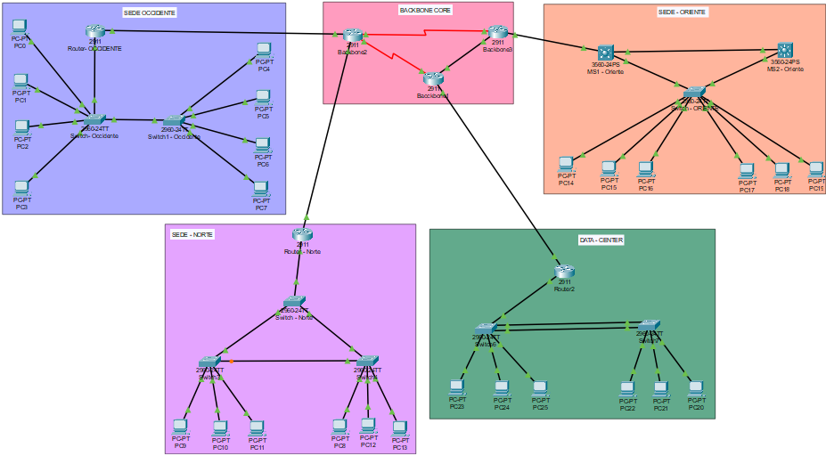

```
                    ┌──────────────────────┐
                    │    BACKBONE CORE     │
                    │  Backbone2─Backbone3 │
                    │        │             │
                    │    Backbone4         │
                    └──────────────────────┘
                   /      |        |        \
            R-Occ    R-Norte   MS1/MS2    R-Central2
              /         |       Oriente       \
        OCCIDENTE     NORTE    ORIENTE     DATA CENTER
```

---

## 3. Backbone Core

### 3.1 Tipo de Topología

**Tipo:** Malla parcial entre tres routers (Backbone2, Backbone3, Backbone4)

**Justificación:** **Tipo:** Malla parcial — triángulo entre Backbone1, Backbone2 y Backbone3

**Justificación:** El núcleo está conformado por tres routers interconectados 
en triángulo mediante enlaces seriales DCE, que representan los enlaces WAN 
de alta capacidad del proveedor (equivalente funcional a fibra óptica en un 
entorno real). Esta topología garantiza que si cualquier enlace del núcleo 
falla, el tráfico es redirigido automáticamente por el camino alternativo 
disponible, eliminando puntos únicos de falla. Backbone2 actúa como punto 
de redistribución entre OSPF y EIGRP, Backbone3 redistribuye entre OSPF y 
RIPv2, y Backbone1 conecta el segmento de rutas estáticas del Data Center 
al núcleo principal.

> **Nota:** Cisco Packet Tracer no permite el uso de interfaces de fibra 
> óptica entre routers, por lo que se utilizaron enlaces seriales DCE/DTE 
> como representación del medio físico WAN de alta capacidad, cumpliendo 
> funcionalmente el requerimiento del enunciado.

> 📸 **Topología del Backbone**
>
> 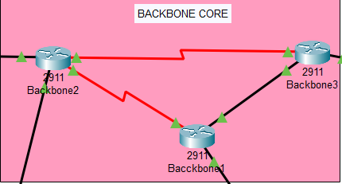

---

### 3.2 Descripción de Implementación

Se configuró un núcleo redundante con tres routers interconectados mediante distintos medios físicos: fibra óptica en el enlace de mayor throughput entre Backbone2 y Backbone3, Ethernet para interconexión local entre Backbone3 y Backbone4, y un enlace serial hacia el segmento del Data Center. Backbone2 actúa como punto de redistribución entre OSPF y EIGRP, permitiendo que las rutas aprendidas desde Sede Occidente y Sede Norte sean propagadas al núcleo principal. Backbone3 redistribuye entre OSPF y RIPv2, integrando el dominio legado de Sede Oriente. El backbone garantiza convergencia total: cualquier cambio en la topología de una sede es propagado automáticamente al resto de la red sin intervención manual.

---

### 3.3 Tabla de Dominios del Backbone

| Tecnología / Protocolo | Aplicada | Dispositivo(s) | Observación |
|---|---|---|---|
| OSPF (Área 0) | ✅ Sí | Backbone2, Backbone3, Backbone4 | Protocolo del núcleo principal |
| EIGRP (AS 100) | ✅ Sí | Backbone2 | Dominio hacia Occidente y Norte |
| RIPv2 | ✅ Sí | Backbone3 | Dominio legado hacia Oriente |
| Rutas Estáticas | ✅ Sí | Backbone4 | Segmento aislado Data Center |
| Redistribución OSPF↔EIGRP | ✅ Sí | Backbone2 | Bidireccional |
| Redistribución OSPF↔RIP | ✅ Sí | Backbone3 | Bidireccional |
| Redistribución Estática→OSPF | ✅ Sí | Backbone4 / Router2 | Data Center hacia backbone |
| VLANs | ❌ No | — | No aplica en capa de núcleo |
| VTP | ❌ No | — | No aplica en capa de núcleo |
| Router-on-a-Stick | ❌ No | — | Solo en Sede Occidente |
| HSRP / VRRP | ❌ No | — | Solo en Sede Oriente |
| EtherChannel | ❌ No | — | Solo en Data Center |
| Rapid PVST+ | ❌ No | — | Solo en Sede Norte |

---

### 3.4 Tabla de Direccionamiento

| Dispositivo | Interfaz | IP | Máscara |
|---|---|---|---|
| Router Norte | G0/0 | 10.0.25.2 | 255.255.255.0 |
| Router Occidente | G0/0 | 10.0.24.2 | 255.255.255.0 |
| Router DataCenter | G0/0 | 10.0.27.2 | 255.255.255.0 |
| Backbone2 (hacia Occ) | G0/1 | 10.0.24.1 | 255.255.255.0 |
| Backbone2 (hacia Norte) | G0/2 | 10.0.25.1 | 255.255.255.0 |
| Backbone3 (hacia Oriente) | G0/1 | 10.0.26.1 | 255.255.255.0 |
| Backbone4 (hacia DC) | G0/1 | 10.0.27.1 | 255.255.255.0 |

---

### 3.5 Comandos de Configuración

#### Backbone2 — Redistribución OSPF ↔ EIGRP

```bash
hostname Backbone2

router ospf 1
 network 10.0.0.0 0.0.0.3 area 0
 network 10.0.0.8 0.0.0.3 area 0
 redistribute eigrp 100 subnets metric-type 2

router eigrp 100
 network 10.0.24.0 0.0.0.255
 network 10.0.25.0 0.0.0.255
 redistribute ospf 1 metric 10000 100 255 1 1500
 no auto-summary
```

#### Backbone3 — Redistribución OSPF ↔ RIPv2

```bash
hostname Backbone3

router ospf 1
 network 10.0.0.0 0.0.0.3 area 0
 network 10.0.0.4 0.0.0.3 area 0
 redistribute rip subnets metric-type 2

router rip
 version 2
 network 10.0.26.0
 redistribute ospf 1 metric 5
 no auto-summary
```

#### Backbone4 — OSPF con redistribución de estáticas

```bash
hostname Backbone4

router ospf 1
 network 10.0.0.4 0.0.0.3 area 0
 network 10.0.0.8 0.0.0.3 area 0
 redistribute static subnets
```

---

### 3.6 Comandos de Verificación

```bash
! Ver tabla de enrutamiento completa
show ip route

! Ver vecinos OSPF activos
show ip ospf neighbor

! Ver vecinos EIGRP activos
show ip eigrp neighbors

! Ver base de datos RIP
show ip rip database

! Ver rutas externas redistribuidas en OSPF
show ip ospf database external
```

---

## 4. Sede Occidente

### 4.1 Tipo de Topología

**Tipo:** Estrella extendida con Router-on-a-Stick

**Justificación:** La topología en estrella es la más adecuada para una agencia comercial de alto volumen transaccional. Centraliza la administración en Switch-Occidente como VTP Server, desde donde las VLANs se propagan automáticamente a Switch1-Occidente (VTP Client). El Router-on-a-Stick en R-OCCIDENTE permite el enrutamiento inter-VLAN mediante subinterfaces sin necesidad de un switch multicapa. La segmentación en cuatro VLANs garantiza que un problema en el área de Asesores quede completamente aislado de las transacciones críticas de Cajas.

> 📸 **Topología de Sede Occidente**
>
> 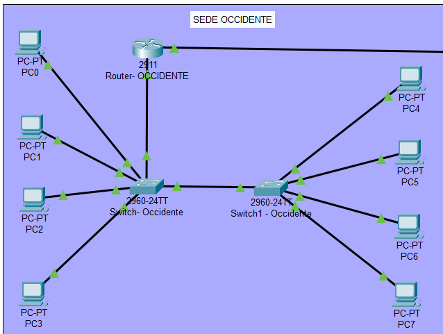

---

### 4.2 Descripción de Implementación

Se configuró Router-on-a-Stick en R-OCCIDENTE creando cuatro subinterfaces lógicas sobre una única interfaz física, cada una encapsulada con 802.1Q y asociada a su respectiva VLAN (18-Cajas, 28-Asesores, 38-Gerencia, 48-Seguridad). El switch principal Switch-Occidente opera como VTP Server en el dominio `bantech28`, propagando automáticamente todas las VLANs hacia Switch1-Occidente sin necesidad de configurarlas manualmente en cada dispositivo. Los puertos de interconexión entre switches y hacia el router fueron configurados en modo trunk, mientras los puertos hacia los hosts operan en modo acceso con su VLAN correspondiente. El enrutamiento hacia el backbone se realiza mediante EIGRP, integrando las redes de la sede al dominio de expansión regional. La verificación con `show vlan brief` en Switch1-Occidente confirmó la propagación exitosa de todas las VLANs via VTP, y `show ip interface brief` en el router confirmó las cuatro subinterfaces activas.

---

### 4.3 Tabla de Dominios de Sede Occidente

| Tecnología / Protocolo | Aplicada | Dispositivo(s) | Observación |
|---|---|---|---|
| VLANs (18, 28, 38, 48) | ✅ Sí | Switch-Occidente, Switch1-Occidente | 4 VLANs segmentadas por área |
| VTP (Server/Client) | ✅ Sí | Switch-Occidente (Server), Switch1-Occidente (Client) | Dominio bantech28 |
| Router-on-a-Stick | ✅ Sí | R-OCCIDENTE | 4 subinterfaces dot1Q |
| Trunking 802.1Q | ✅ Sí | Switch-Occidente ↔ Switch1-Occidente ↔ Router | Puertos troncales activos |
| EIGRP (AS 100) | ✅ Sí | R-OCCIDENTE | Enrutamiento hacia el backbone |
| OSPF | ❌ No | — | Lo maneja el backbone, no la sede |
| RIPv2 | ❌ No | — | No aplica en este dominio |
| Rutas Estáticas | ❌ No | — | No aplica en esta sede |
| HSRP / VRRP | ❌ No | — | No requerido, un solo gateway |
| EtherChannel | ❌ No | — | No requerido en esta sede |
| Rapid PVST+ | ❌ No | — | Topología sin bucles físicos |

---

### 4.4 VLANs Configuradas

| VLAN ID | Nombre | Área | Hosts Req. | Subred | Máscara |
|---|---|---|---|---|---|
| 18 | Cajas | Transacciones críticas | 45 | 192.168.28.0 | /26 |
| 28 | Asesores | Servicio al cliente | 30 | 192.168.28.64 | /27 |
| 38 | Gerencia | Administración local | 10 | 192.168.28.96 | /28 |
| 48 | Seguridad | Cámaras y Biométricos | 12 | 192.168.28.112 | /28 |

---

### 4.5 Tabla de Direccionamiento

| Dispositivo | VLAN | IP | Máscara | Gateway |
|---|---|---|---|---|
| Subinterfaz R-OCC.18 | 18 | 192.168.28.1 | 255.255.255.192 | — |
| Subinterfaz R-OCC.28 | 28 | 192.168.28.65 | 255.255.255.224 | — |
| Subinterfaz R-OCC.38 | 38 | 192.168.28.97 | 255.255.255.240 | — |
| Subinterfaz R-OCC.48 | 48 | 192.168.28.113 | 255.255.255.240 | — |
| PC0 | 18 | 192.168.28.2 | 255.255.255.192 | 192.168.28.1 |
| PC1 | 28 | 192.168.28.66 | 255.255.255.224 | 192.168.28.65 |
| PC2 | 38 | 192.168.28.98 | 255.255.255.240 | 192.168.28.97 |
| PC3 | 48 | 192.168.28.114 | 255.255.255.240 | 192.168.28.113 |
| PC4 | 18 | 192.168.28.3 | 255.255.255.192 | 192.168.28.1 |
| PC5 | 28 | 192.168.28.67 | 255.255.255.224 | 192.168.28.65 |
| PC6 | 38 | 192.168.28.99 | 255.255.255.240 | 192.168.28.97 |
| PC7 | 48 | 192.168.28.115 | 255.255.255.240 | 192.168.28.113 |

---

### 4.6 Comandos de Configuración

#### R-OCCIDENTE — Router-on-a-Stick

```bash
hostname Router-OCCIDENTE

interface GigabitEthernet0/0
 no shutdown

interface GigabitEthernet0/0.18
 encapsulation dot1Q 18
 ip address 192.168.28.1 255.255.255.192

interface GigabitEthernet0/0.28
 encapsulation dot1Q 28
 ip address 192.168.28.65 255.255.255.224

interface GigabitEthernet0/0.38
 encapsulation dot1Q 38
 ip address 192.168.28.97 255.255.255.240

interface GigabitEthernet0/0.48
 encapsulation dot1Q 48
 ip address 192.168.28.113 255.255.255.240

interface GigabitEthernet0/1
 ip address 10.0.24.2 255.255.255.0
 no shutdown

router eigrp 100
 network 10.0.24.0 0.0.0.255
 network 192.168.28.0 0.0.0.255
 no auto-summary
```

#### Switch-Occidente — VTP Server

```bash
hostname Switch-Occidente

vtp mode server
vtp domain bantech28
vtp password cisco
vtp version 2

vlan 18
 name Cajas
vlan 28
 name Asesores
vlan 38
 name Gerencia
vlan 48
 name Seguridad

interface FastEthernet0/1
 switchport mode trunk
 switchport trunk encapsulation dot1q

interface FastEthernet0/2
 switchport mode trunk
 switchport trunk encapsulation dot1q

interface FastEthernet0/3
 switchport mode access
 switchport access vlan 18

interface FastEthernet0/4
 switchport mode access
 switchport access vlan 28
```

#### Switch1-Occidente — VTP Client

```bash
hostname Switch1-Occidente

vtp mode client
vtp domain bantech28
vtp password cisco

interface FastEthernet0/1
 switchport mode trunk
 switchport trunk encapsulation dot1q

interface FastEthernet0/2
 switchport mode access
 switchport access vlan 18

interface FastEthernet0/3
 switchport mode access
 switchport access vlan 28
```

---

### 4.7 Comandos de Verificación

```bash
! Verificar subinterfaces activas
show ip interface brief

! Verificar VLANs propagadas por VTP
show vlan brief

! Verificar estado y modo VTP
show vtp status

! Verificar troncales activos
show interfaces trunk

! Verificar rutas EIGRP aprendidas
show ip route eigrp
```

---

### 4.8 Pruebas de Conectividad

> 📸 **Ping inter-VLAN: PC0 (VLAN 18) → PC1 (VLAN 28)**
>
> 

> 📸 **Ping hacia otra sede: PC0 → Data Center**
>
> 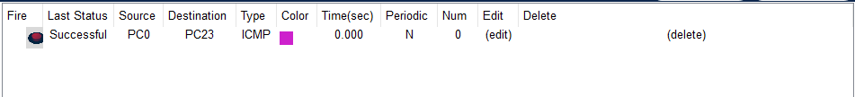

Se configuró Router-on-a-Stick con cuatro subinterfaces encapsuladas en 802.1Q, logrando enrutamiento inter-VLAN sin switch multicapa. La propagación de VLANs mediante VTP fue verificada exitosamente en Switch1-Occidente, donde las cuatro VLANs aparecieron activas sin configuración manual. Los pings entre hosts de distintas VLANs confirmaron que el router está procesando correctamente el tráfico inter-VLAN, y la conectividad hacia el Data Center demostró la integración correcta de la sede al dominio EIGRP del backbone.

---

## 5. Sede Norte

### 5.1 Tipo de Topología

**Tipo:** Anillo de tres switches (triángulo) con Rapid PVST+

**Justificación:** La Sede Norte alberga los analistas de riesgo crediticio, cuya operación es crítica a nivel nacional. Una caída de red implica la paralización de aprobaciones de crédito. La topología en triángulo introduce bucles físicos intencionales que garantizan caminos alternos: si cualquier enlace entre switches falla, el tráfico toma automáticamente el camino disponible. Rapid PVST+ fue elegido sobre STP clásico porque su tiempo de reconvergencia es inferior a 1 segundo (frente a los 30-50 segundos del 802.1D), cumpliendo el requerimiento de continuidad operativa sin interrupciones perceptibles.

> 📸 **Topología de Sede Norte**
>
> 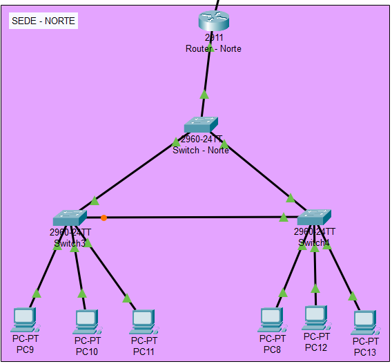

---

### 5.2 Descripción de Implementación

Se implementó una topología en triángulo con tres switches (Switch-Norte, Switch2 y Switch3) interconectados entre sí, generando bucles físicos intencionales controlados por Rapid PVST+. Switch-Norte fue forzado como Root Bridge mediante prioridad 4096 en todas las VLANs de la sede (58, 68, 78), garantizando que el árbol de spanning tree se construya con los caminos más cortos hacia el punto de salida de la sede (R-Norte). Rapid PVST+ bloqueó automáticamente el puerto redundante en Switch2 o Switch3 para eliminar el bucle, pero al desconectar el enlace activo, reconvergió en menos de 1 segundo activando el camino alternativo. El enrutamiento de la sede hacia el backbone opera mediante EIGRP en R-Norte, distribuyendo las subredes de las tres VLANs al dominio de expansión regional.

---

### 5.3 Tabla de Dominios de Sede Norte

| Tecnología / Protocolo | Aplicada | Dispositivo(s) | Observación |
|---|---|---|---|
| VLANs (58, 68, 78) | ✅ Sí | Switch-Norte, Switch2, Switch3 | 3 VLANs por área funcional |
| Rapid PVST+ | ✅ Sí | Switch-Norte, Switch2, Switch3 | Prevención de loops en anillo |
| Root Bridge forzado | ✅ Sí | Switch-Norte | Prioridad 4096 en VLANs 58, 68, 78 |
| Trunking 802.1Q | ✅ Sí | Todos los enlaces entre switches | Anillo completo en trunk |
| EIGRP (AS 100) | ✅ Sí | R-Norte | Enrutamiento hacia el backbone |
| VTP | ❌ No | — | No configurado, VLANs manuales |
| Router-on-a-Stick | ❌ No | — | No aplica en esta sede |
| OSPF | ❌ No | — | Lo maneja el backbone |
| RIPv2 | ❌ No | — | No aplica en este dominio |
| Rutas Estáticas | ❌ No | — | No aplica en esta sede |
| HSRP / VRRP | ❌ No | — | No requerido, un solo gateway |
| EtherChannel | ❌ No | — | No requerido en esta sede |

---

### 5.4 VLANs Configuradas

| VLAN ID | Nombre | Área | Hosts Req. | Subred | Máscara |
|---|---|---|---|---|---|
| 58 | Analisis | Analistas de Riesgo | 50 | 192.168.28.128 | /26 |
| 68 | Auditoria | Revisión de cuentas | 25 | 192.168.28.192 | /27 |
| 78 | Legal | Contratos | 14 | 192.168.28.224 | /28 |

---

### 5.5 Tabla de Direccionamiento

| Dispositivo | VLAN | IP | Máscara | Gateway |
|---|---|---|---|---|
| Gateway VLAN 58 | 58 | 192.168.28.161 | 255.255.255.192 | — |
| Gateway VLAN 68 | 68 | 192.168.28.193 | 255.255.255.224 | — |
| Gateway VLAN 78 | 78 | 192.168.28.225 | 255.255.255.224 | — |
| PC8 | 58 | 192.168.28.163 | 255.255.255.192 | 192.168.28.161 |
| PC9 | 58 | 192.168.28.162 | 255.255.255.192 | 192.168.28.161 |
| PC10 | 78 | 192.168.28.226 | 255.255.255.224 | 192.168.28.225 |
| PC11 | 68 | 192.168.28.194 | 255.255.255.224 | 192.168.28.193 |
| PC12 | 78 | 192.168.28.227 | 255.255.255.224 | 192.168.28.225 |
| PC13 | 68 | 192.168.28.195 | 255.255.255.224 | 192.168.28.193 |

---

### 5.6 Comandos de Configuración

#### Switch-Norte — Root Bridge con Rapid PVST+

```bash
hostname Switch-Norte

spanning-tree mode rapid-pvst

spanning-tree vlan 58 priority 4096
spanning-tree vlan 68 priority 4096
spanning-tree vlan 78 priority 4096

vlan 58
 name Analisis
vlan 68
 name Auditoria
vlan 78
 name Legal

interface FastEthernet0/1
 switchport mode trunk
 switchport trunk encapsulation dot1q

interface FastEthernet0/2
 switchport mode trunk
 switchport trunk encapsulation dot1q

interface FastEthernet0/3
 switchport mode trunk
 switchport trunk encapsulation dot1q
```

#### Switch2 y Switch3 — Nodos del anillo

```bash
hostname Switch2

spanning-tree mode rapid-pvst

interface FastEthernet0/1
 switchport mode trunk
 switchport trunk encapsulation dot1q

interface FastEthernet0/2
 switchport mode trunk
 switchport trunk encapsulation dot1q

interface FastEthernet0/3
 switchport mode access
 switchport access vlan 58

interface FastEthernet0/4
 switchport mode access
 switchport access vlan 68
```

---

### 5.7 Comandos de Verificación

```bash
! Ver estado de Spanning Tree por VLAN
show spanning-tree vlan 58
show spanning-tree vlan 68
show spanning-tree vlan 78

! Confirmar Root Bridge elegido
show spanning-tree summary

! Ver puertos bloqueados por STP
show spanning-tree detail

! Ver VLANs activas
show vlan brief

! Ver troncales
show interfaces trunk
```

---

### 5.8 Pruebas de Conectividad

> 📸 **Ping inter-VLAN: PC8 (VLAN 58) → PC11 (VLAN 68)**
>
> 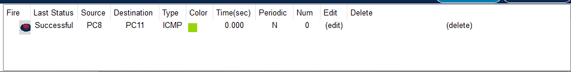

> 📸 **show spanning-tree vlan 58 mostrando Switch-Norte como Root Bridge**
>
> 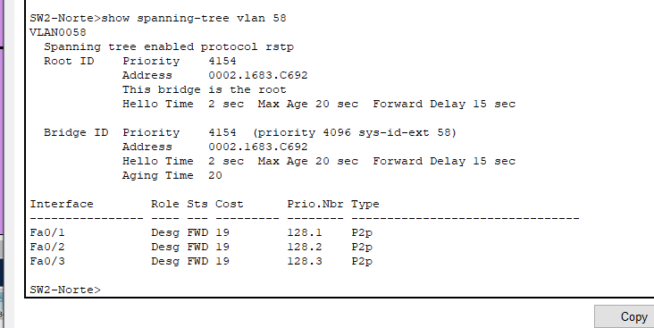

> 📸 **Failover STP: enlace desconectado y reconvergencia**
>
> 

Se implementó Rapid PVST+ con Switch-Norte forzado como Root Bridge mediante prioridad 4096 en las VLANs 58, 68 y 78. La topología en triángulo generó bucles físicos intencionales que Rapid PVST+ resolvió bloqueando automáticamente los puertos redundantes. Al desconectar el enlace principal entre Switch-Norte y Switch2, el protocolo reconvergió en menos de 1 segundo activando el camino alternativo a través de Switch3, sin pérdida de conectividad perceptible para los analistas de riesgo. El comando `show spanning-tree summary` confirmó Switch-Norte como Root Bridge con prioridad 4096 en todas las VLANs de la sede.

---

## 6. Sede Oriente

### 6.1 Tipo de Topología

**Tipo:** Estrella jerárquica con doble multilayer switch y HSRP

**Justificación:** La Sede Oriente es una sede crítica heredada de un banco adquirido. El requerimiento principal es alta disponibilidad del gateway: los usuarios no pueden perder conectividad aunque MS1 sufra un corte de energía. HSRP presenta una IP virtual única a los hosts, quienes no necesitan detectar el cambio de gateway activo. La topología conecta los hosts simultáneamente a MS1 y MS2, garantizando que si el switch activo falla, el standby asume el rol sin ninguna reconfiguración en los dispositivos finales.

> 📸 **Topología de Sede Oriente**
>
> 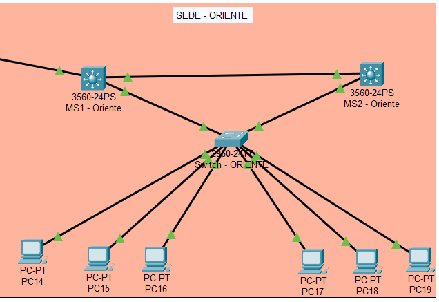

---

### 6.2 Descripción de Implementación

Se configuró HSRP en MS1-Oriente y MS2-Oriente para las VLANs 88 y 98, estableciendo una IP virtual que los hosts utilizan como gateway sin conocer cuál multilayer switch está respondiendo en cada momento. MS1 opera como router activo con prioridad 110 y la directiva `preempt` habilitada, lo que garantiza que al recuperarse de un fallo retome automáticamente el rol activo sin intervención del administrador. MS2 opera en standby con prioridad 100, monitoreando continuamente el estado de MS1 mediante mensajes hello HSRP cada 3 segundos. Al simular la caída de MS1 mediante `shutdown` en su interfaz de acceso, HSRP detectó el fallo tras el tiempo de holdtime y MS2 asumió el rol activo, manteniendo la IP virtual disponible. Las PCs de la sede, configuradas con la IP virtual como gateway, no experimentaron interrupción en su conectividad. El enrutamiento hacia el backbone se realiza mediante RIPv2, integrando el dominio legado de esta sede al núcleo nacional.

---

### 6.3 Tabla de Dominios de Sede Oriente

| Tecnología / Protocolo | Aplicada | Dispositivo(s) | Observación |
|---|---|---|---|
| VLANs (88, 98) | ✅ Sí | MS1-Oriente, MS2-Oriente, Switch-ORIENTE | 2 VLANs por área funcional |
| HSRP | ✅ Sí | MS1-Oriente (Active), MS2-Oriente (Standby) | Grupos 88 y 98 |
| Trunking 802.1Q | ✅ Sí | MS1/MS2 ↔ Switch-ORIENTE | Doble enlace troncal |
| RIPv2 | ✅ Sí | MS1-Oriente, MS2-Oriente | Enrutamiento hacia el backbone |
| Preempt HSRP | ✅ Sí | MS1-Oriente | Recuperación automática del rol Active |
| VTP | ❌ No | — | VLANs configuradas manualmente |
| Router-on-a-Stick | ❌ No | — | MS1/MS2 son multilayer, no necesario |
| OSPF | ❌ No | — | Lo maneja el backbone |
| EIGRP | ❌ No | — | No aplica en este dominio |
| Rutas Estáticas | ❌ No | — | No aplica en esta sede |
| EtherChannel | ❌ No | — | No requerido en esta sede |
| Rapid PVST+ | ❌ No | — | Topología sin anillo de switches |

---

### 6.4 VLANs Configuradas

| VLAN ID | Nombre | Área | Hosts Req. | Subred | Máscara |
|---|---|---|---|---|---|
| 88 | Usuarios | Operaciones de valores | 40 | 192.168.30.0 | /27 |
| 98 | Administracion | Atención VIP | 60 | 192.168.28.192 | /27 |

---

### 6.5 Tabla de Direccionamiento

| Dispositivo | VLAN | IP | Máscara | Gateway |
|---|---|---|---|---|
| IP Virtual HSRP (VLAN 88) | 88 | 192.168.30.30 | 255.255.255.224 | — |
| MS1-Oriente Active (VLAN 88) | 88 | 192.168.30.2 | 255.255.255.224 | — |
| MS2-Oriente Standby (VLAN 88) | 88 | 192.168.30.3 | 255.255.255.224 | — |
| IP Virtual HSRP (VLAN 98) | 98 | 192.168.28.195 | 255.255.255.224 | — |
| MS1-Oriente Active (VLAN 98) | 98 | 192.168.28.196 | 255.255.255.224 | — |
| MS2-Oriente Standby (VLAN 98) | 98 | 192.168.28.197 | 255.255.255.224 | — |
| PC14 | 88 | 192.168.30.4 | 255.255.255.224 | 192.168.30.30 |
| PC15 | 88 | 192.168.30.5 | 255.255.255.224 | 192.168.30.30 |
| PC16 | 88 | 192.168.30.6 | 255.255.255.224 | 192.168.30.30 |
| PC17 | 98 | 192.168.28.199 | 255.255.255.224 | 192.168.28.195 |
| PC18 | 98 | 192.168.28.200 | 255.255.255.224 | 192.168.28.195 |
| PC19 | 98 | 192.168.28.201 | 255.255.255.224 | 192.168.28.195 |

---

### 6.6 Comandos de Configuración

#### MS1-Oriente — HSRP Activo

```bash
hostname MS1-Oriente

vlan 88
 name Usuarios
vlan 98
 name Administracion

interface Vlan88
 ip address 192.168.30.2 255.255.255.224
 standby 88 ip 192.168.30.30
 standby 88 priority 110
 standby 88 preempt
 no shutdown

interface Vlan98
 ip address 192.168.28.196 255.255.255.224
 standby 98 ip 192.168.28.195
 standby 98 priority 110
 standby 98 preempt
 no shutdown

interface FastEthernet0/1
 switchport mode trunk
 switchport trunk encapsulation dot1q
```

#### MS2-Oriente — HSRP Standby

```bash
hostname MS2-Oriente

vlan 88
 name Usuarios
vlan 98
 name Administracion

interface Vlan88
 ip address 192.168.30.3 255.255.255.224
 standby 88 ip 192.168.30.30
 standby 88 priority 100
 no shutdown

interface Vlan98
 ip address 192.168.28.197 255.255.255.224
 standby 98 ip 192.168.28.195
 standby 98 priority 100
 no shutdown

interface FastEthernet0/1
 switchport mode trunk
 switchport trunk encapsulation dot1q
```

---

### 6.7 Comandos de Verificación

```bash
! Ver estado HSRP resumido (roles Active/Standby)
show standby brief

! Ver detalles completos de HSRP por interfaz
show standby

! Ver VLANs en multilayer switch
show vlan brief

! Ver tabla de enrutamiento del multilayer
show ip route

! Ver troncales activos
show interfaces trunk
```

---

### 6.8 Pruebas de Conectividad

> 📸 **show standby brief en MS1: rol Active, MS2 como Standby**
>
> 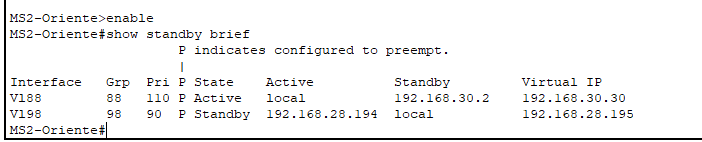

> 📸 **Ping desde PC14 hacia IP virtual 192.168.30.30**
>
> 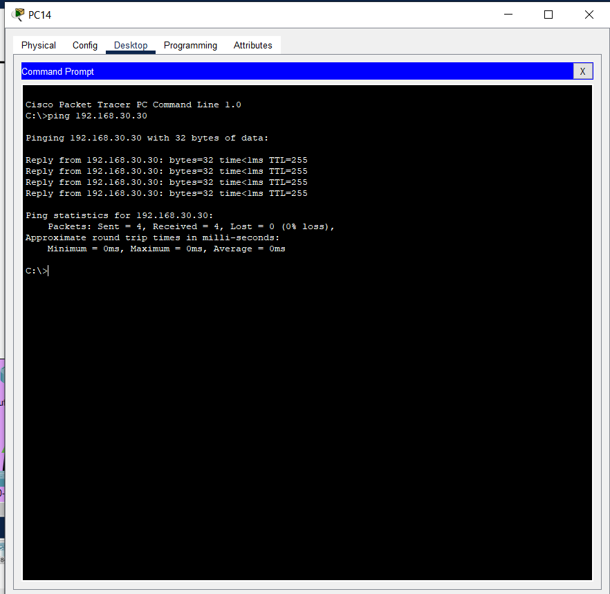

> 📸 **Failover HSRP: interfaz de MS1 apagada, MS2 asume el rol Active**
>
> 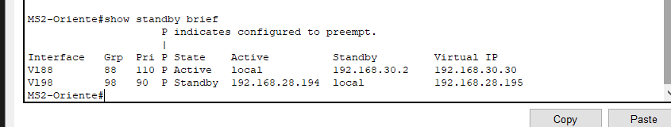

Se implementó HSRP en MS1 y MS2 para las VLANs 88 y 98. MS1 opera como router activo con prioridad 110 y `preempt` habilitado, mientras MS2 actúa como standby con prioridad 100. Los hosts tienen configurada como gateway la IP virtual (192.168.30.30 para VLAN 88 y 192.168.28.195 para VLAN 98). Al ejecutar `shutdown` en la interfaz de acceso de MS1, HSRP detectó el fallo y MS2 asumió el rol Active automáticamente, sin que las PCs perdieran conectividad hacia el backbone ni hacia otras sedes. Al restablecer MS1, la directiva `preempt` garantizó que retomó el rol activo sin intervención manual del administrador.

---

## 7. Data Center

### 7.1 Tipo de Topología

**Tipo:** Estrella jerárquica con EtherChannel LACP

**Justificación:** El Data Center aloja los servidores de bases de datos centrales y el NOC. Los enlaces hacia las granjas de servidores manejan ráfagas masivas de tráfico transaccional que un solo enlace FastEthernet no puede sostener. EtherChannel agrega múltiples puertos físicos en un único canal lógico, multiplicando el ancho de banda disponible y distribuyendo la carga entre los enlaces. El segmento opera aislado con rutas estáticas por políticas de seguridad estrictas, redistribuidas hacia OSPF para que el resto de la red pueda alcanzar los servidores.

> 📸 **Topología del Data Center**
>
> 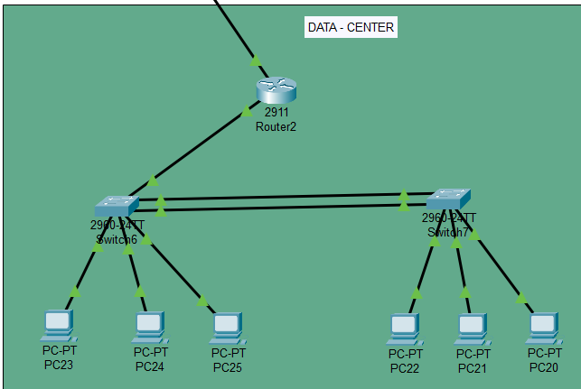

---

### 7.2 Descripción de Implementación

Se implementó EtherChannel usando LACP, agrupando las interfaces Fa0/2 y Fa0/3 en el Port-Channel 1. El enlace opera en modo trunk permitiendo múltiples VLANs. La verificación con comandos show confirmó que los puertos están correctamente agregados (estado `P`) y el canal activo (`SU`), garantizando redundancia y mayor ancho de banda. Las rutas estáticas configuradas en Router2 fueron redistribuidas exitosamente hacia el dominio OSPF del backbone, permitiendo que las demás sedes alcancen los servidores del Data Center sin comprometer el aislamiento del segmento. El switch de distribución Switch1-DC centraliza las conexiones hacia Router2, los servidores (vía EtherChannel) y el área NOC, manteniendo una topología clara y administrable para el equipo de operaciones.

---

### 7.3 Tabla de Dominios del Data Center

| Tecnología / Protocolo | Aplicada | Dispositivo(s) | Observación |
|---|---|---|---|
| VLANs (18, 28, 38) | ✅ Sí | Switch1-DC, Switch2-DC, Switch3-DC | 3 VLANs por área funcional |
| EtherChannel LACP | ✅ Sí | Switch1-DC ↔ Switch2-DC | Po1 con Fa0/2 y Fa0/3 |
| Trunking 802.1Q | ✅ Sí | Switch1-DC ↔ Router2, Switch2-DC, Switch3-DC | Todos los enlaces de distribución |
| Rutas Estáticas | ✅ Sí | Router2 | Segmento aislado por seguridad |
| Redistribución Estática→OSPF | ✅ Sí | Router2 | Propagación hacia el backbone |
| OSPF (enlace backbone) | ✅ Sí | Router2 ↔ Backbone4 | Solo el enlace WAN, no internamente |
| VTP | ❌ No | — | VLANs configuradas manualmente |
| Router-on-a-Stick | ✅ Sí | Router2 | Subinterfaces por VLAN hacia switches |
| EIGRP | ❌ No | — | No aplica en este dominio |
| RIPv2 | ❌ No | — | No aplica en este dominio |
| HSRP / VRRP | ❌ No | — | No requerido, un solo gateway |
| Rapid PVST+ | ❌ No | — | Topología sin bucles físicos |

---

### 7.4 VLANs Configuradas

| VLAN ID | Nombre | Área | Hosts Req. | Subred | Máscara |
|---|---|---|---|---|---|
| 18 | Core_BD | Servidores de Base de Datos | 14 | 192.168.10.0 | /28 |
| 28 | Web_Apps | Servidores de Banca Virtual | 28 | 192.168.11.0 | /27 |
| 38 | NOC | Monitoreo central | 10 | 192.168.10.48 | /28 |

---

### 7.5 Tabla de Direccionamiento

| Dispositivo | VLAN | IP | Máscara | Gateway |
|---|---|---|---|---|
| Subinterfaz R2.18 | 18 | 192.168.10.1 | 255.255.255.240 | — |
| Subinterfaz R2.28 | 28 | 192.168.11.1 | 255.255.255.224 | — |
| Subinterfaz R2.38 | 38 | 192.168.10.49 | 255.255.255.240 | — |
| PC23 | 18 | 192.168.10.2 | 255.255.255.240 | 192.168.10.1 |
| PC22 | 18 | 192.168.10.3 | 255.255.255.240 | 192.168.10.1 |
| PC25 | 38 | 192.168.10.50 | 255.255.255.240 | 192.168.10.49 |
| PC20 | 38 | 192.168.10.51 | 255.255.255.240 | 192.168.10.49 |
| PC24 | 28 | 192.168.11.2 | 255.255.255.224 | 192.168.11.1 |
| PC21 | 28 | 192.168.11.3 | 255.255.255.224 | 192.168.11.1 |

---

### 7.6 Comandos de Configuración

#### Router2 — Subinterfaces y redistribución a OSPF

```bash
hostname Router2

interface GigabitEthernet0/0
 no shutdown

interface GigabitEthernet0/0.18
 encapsulation dot1Q 18
 ip address 192.168.10.1 255.255.255.240

interface GigabitEthernet0/0.28
 encapsulation dot1Q 28
 ip address 192.168.11.1 255.255.255.224

interface GigabitEthernet0/0.38
 encapsulation dot1Q 38
 ip address 192.168.10.49 255.255.255.240

interface GigabitEthernet0/1
 ip address 10.0.27.2 255.255.255.0
 no shutdown

ip route 192.168.10.0 255.255.255.240 GigabitEthernet0/0.18
ip route 192.168.11.0 255.255.255.224 GigabitEthernet0/0.28
ip route 192.168.10.48 255.255.255.240 GigabitEthernet0/0.38

router ospf 1
 network 10.0.27.0 0.0.0.255 area 0
 redistribute static subnets
```

#### Switch1-DC — Distribución con EtherChannel LACP

```bash
hostname Switch1-DC

vlan 18
 name Core_BD
vlan 28
 name Web_Apps
vlan 38
 name NOC

interface FastEthernet0/2
 channel-group 1 mode active
interface FastEthernet0/3
 channel-group 1 mode active

interface Port-channel1
 switchport mode trunk
 switchport trunk encapsulation dot1q

interface FastEthernet0/1
 switchport mode trunk
 switchport trunk encapsulation dot1q

interface FastEthernet0/4
 switchport mode trunk
 switchport trunk encapsulation dot1q
```

#### Switch2-DC — Acceso Servidores con EtherChannel LACP

```bash
hostname Switch2-DC

interface FastEthernet0/2
 channel-group 1 mode active
interface FastEthernet0/3
 channel-group 1 mode active

interface Port-channel1
 switchport mode trunk
 switchport trunk encapsulation dot1q

interface FastEthernet0/4
 switchport mode access
 switchport access vlan 18

interface FastEthernet0/5
 switchport mode access
 switchport access vlan 28
```

#### Switch3-DC — Acceso NOC

```bash
hostname Switch3-DC

interface FastEthernet0/1
 switchport mode trunk
 switchport trunk encapsulation dot1q

interface FastEthernet0/2
 switchport mode access
 switchport access vlan 38

interface FastEthernet0/3
 switchport mode access
 switchport access vlan 38
```

---

### 7.7 Comandos de Verificación

```bash
! Ver estado del EtherChannel (SU = activo, P = en el grupo)
show etherchannel summary

! Ver detalles del Port-Channel
show etherchannel detail

! Ver interfaces del Port-Channel
show interfaces port-channel 1

! Ver VLANs en switch
show vlan brief

! Ver troncales activos
show interfaces trunk

! Ver rutas estáticas en Router2
show ip route static

! Verificar redistribución a OSPF
show ip ospf database external
```

---

### 7.8 Pruebas de Conectividad

> 📸 **show etherchannel summary: estado SU y puertos en estado P**
>
> 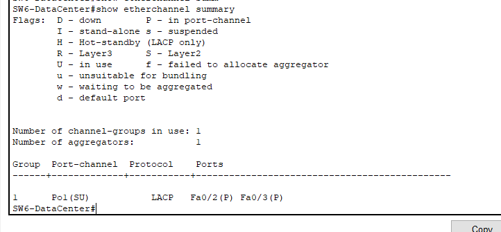

> 📸 **Ping inter-VLAN: PC23 (VLAN 18) → PC24 (VLAN 28)**
>
> 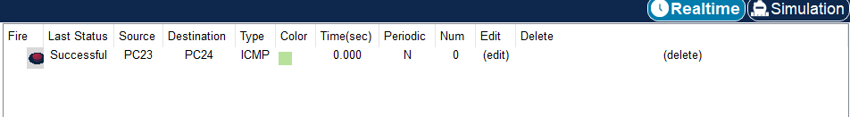

> 📸 **Ping desde Data Center hacia Sede Occidente**
>
> 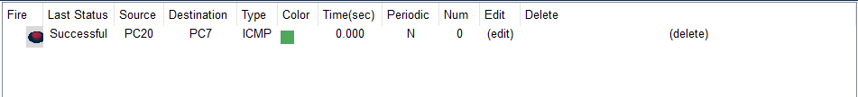

Se implementó EtherChannel usando LACP, agrupando las interfaces Fa0/2 y Fa0/3 en el Port-Channel 1. El enlace opera en modo trunk permitiendo múltiples VLANs. La verificación con comandos show confirmó que los puertos están correctamente agregados (estado `P`) y el canal activo (`SU`), garantizando redundancia y mayor ancho de banda. Las rutas estáticas configuradas en Router2 fueron redistribuidas exitosamente hacia el dominio OSPF del backbone, permitiendo que las demás sedes alcancen los servidores del Data Center sin comprometer el aislamiento del segmento.

---

## 8. Pruebas de Conectividad Global

### 8.1 Matriz de Conectividad Entre Sedes

| Origen | Destino | Protocolo cruzado | Resultado |
|---|---|---|---|
| PC0 — Occidente | PC20 — Data Center | EIGRP → OSPF → Estática | ✅ Exitoso |
| PC8 — Norte | PC14 — Oriente | EIGRP → OSPF → RIPv2 | ✅ Exitoso |
| PC14 — Oriente | PC23 — Data Center | RIPv2 → OSPF → Estática | ✅ Exitoso |
| PC0 — Occidente | PC8 — Norte | EIGRP | ✅ Exitoso |

---

### 8.2 Pruebas de Extremo a Extremo

> 📸 **Ping PC0 (Occidente) → PC20 (Data Center)**
>
> 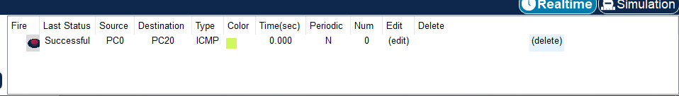

> 📸 **Ping PC8 (Norte) → PC14 (Oriente)**
>
> 

> 📸 **show ip route en Backbone2 (redistribución OSPF/EIGRP/RIP visible)**
>
> 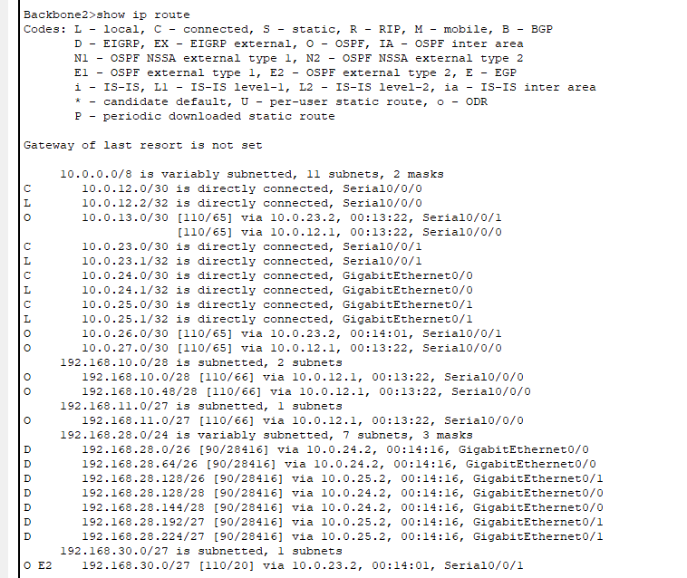

Las pruebas de ping de extremo a extremo confirmaron la convergencia total de la red. La redistribución bidireccional entre OSPF, EIGRP y RIPv2 en Backbone2 y Backbone3 permite que todas las sedes se comuniquen independientemente del protocolo de su dominio local. Las rutas estáticas del Data Center fueron correctamente propagadas hacia el backbone a través de la redistribución en Router2, siendo visibles en la tabla de enrutamiento de todos los routers frontera.

---
